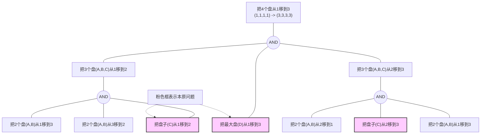

# 知识表示

## 一、 选择题

### 1. 下列说法正确的是： ( C )

* (A) 置换可以交换
* (B) 公式集总可以合一
* **(C) 语义网络是知识的图解表示**
* (D) “时间”是“春天”的实例

> **【知识点】** 知识表示基本概念、一阶谓词逻辑运算。
> **【解析】** 语义网络由节点和弧组成，本质上是一种结构化的图解表示。置换（Substitution）通常不满足交换律；并非所有公式集都存在合一（Unification）项；在 (D) 中，“春天”是“时间”的实例或子类，逻辑关系颠倒。

### 2. 在表示和求解比较复杂的问题时，往往采用哪些表示方法？ ( B )
* (A) 状态空间法 
* **(B) 框架表示法**
* (C) 语义网络法 
* (D) 谓词逻辑法

> **【知识点】** 框架表示法（Frame Representation）。
> **【解析】** 框架表示法适合表示结构化、分层级的复杂常识和对象属性，通过“槽”和“侧面”能高效组织复杂逻辑。

### 3. 语义网络表示法一般以下哪种继承是不存在的？ ( D )
* (A) 值继承 
* (B) “如果需要”继承
* (C) “默认”继承 
* **(D) 左右继承**

> **【知识点】** 语义网络的推理机制：继承。
> **【解析】** 继承是语义网络的核心，包括值继承、默认继承和程序性的“如果需要”继承。不存在物理方位的“左右继承”。

### 4. 下列哪些不属于谓词逻辑的基本组成部分？ ( D )
* (A) 谓词符号 
* (B) 变量符号
* (C) 函数符号 
* **(D) 操作符**

> **【知识点】** 一阶谓词演算的语法成分。
> **【解析】** 谓词逻辑由谓词、变量、常量、函数和量词组成。操作符（Operator）通常是状态空间法中用于改变状态的算子。

### 5. 假设 P 为真，Q 为假，下列公式为真的值是： ( A )
* **(A) $P \lor Q$**
* (B) $P \land Q$ 
* (C) $P \Rightarrow Q$ 
* (D) $\neg P$

> **【知识点】** 逻辑联结词真值表。
> **【解析】** $P$ 为真时，析取式 $P \lor Q$ 必为真。而蕴含式 $P \Rightarrow Q$ 在“真推假”时为假。

### 6. 下列人物哪些提出过语义网络方法？ ( A )
* **(A) Simmons** 
* (B) Brooks 
* (C) Slocum 
* (D) Winner

> **【知识点】** 人工智能历史。
> **【解析】** Quillian 提出了语义网络，Simmons 在此基础上将其应用于自然语言理解。

### 7. 下列知识表示方法属于陈述式知识表示方法的是： ( A, B, C )
* **(A) 语义网络**
* **(B) 框架**
* **(C) 剧本**
* (D) 过程

> **【知识点】** 陈述式 vs 过程式知识表示。
> **【解析】** 陈述式描述“是什么”（如事实、结构），过程式描述“怎么做”（如算法、过程）。

### 8. 下列关于知识的说法正确的是： ( A, B, C )

* **(A) 知识是经过削减、塑造、解释和转换的信息**
* **(B) 知识是经过加工的信息**
* **(C) 知识是事实、信念和启发式规则**
* (D) 知识是凭空想象的

> **【知识点】** 知识的定义。
> **【解析】** 知识是处理后的、具有逻辑结构的信息。

### 9. “雪是白色的”，这句话是： ( A )
* **(A) 事实**
* (B) 规则 
* (C) 控制 
* (D) 元知识

> **【解析】** 这是一句客观描述对象属性的断言，属于事实。

### 10. 下列计算机语言一般属于基于对象的知识表示的人工智能语言的是： ( C )

* (A) Lisp 
* (B) Prolog 
* **(C) Smalltalk**
* (D) Visual Basic

> **【知识点】** AI 编程语言特性。
> **【解析】** Smalltalk 是典型的面向对象语言，常用于实现具有继承特性的框架系统。

### 11. 下列等价关系不成立的是： ( D )

* (A) $\neg (\neg P) \equiv P$
* (B) $P \lor Q \equiv \neg P \Rightarrow Q$
* (C) $\neg (P \lor Q) \equiv \neg P \land \neg Q$
* **(D) $P \Rightarrow Q \equiv \neg P \Rightarrow \neg Q$**

> **【知识点】** 谓词逻辑等价定律（德·摩根律、蕴含等价律）。
> **【解析】** $P \Rightarrow Q$ 的等价形式是其逆否命题 $\neg Q \Rightarrow \neg P$，而非否命题。

### 12. 操作符可以为： ( A, B, C, D )

* **(A) 走步** 
* **(B) 过程** 
* **(C) 规则** 
* **(D) 数学算子**

> **【解析】** 在状态空间和问题求解中，凡是能引起状态改变的行为均可作为操作符。

### 13. 在梵塔问题归约图中，某子问题属于本原问题，那么此子问题的解应该包含 ( A ) 步移动。

* **(A) 1**
* (B) 2 
* (C) 3 
* (D) 4

> **【知识点】** 本原问题（Primitive Problem）。
> **【解析】** 本原问题是不可再分的最小单元，对应一步基本操作。

### 14. 在与或图中，只要解决某个子问题就可解决其父辈问题的节点集合是指： ( B )

* (A) 终叶节点 
* **(B) 或节点**
* (C) 与节点 
* (D) 后继节点

> **【知识点】** 与或图（AND/OR Graph）。
> **【解析】** 或节点（OR Node）表示子节点之间是“并列”关系，一获解则全获解。

### 15. 下列节点中一定是不可解节点的是： ( D )

* (A) 没有后裔的节点
* (B) 终叶节点
* (C) 后继节点
* **(D) 此节点是非终叶节点，如果它有或后继节点，那么其全部后裔都是不可解的**

> **【知识点】** 不可解节点的定义。
> **【解析】** 如果解决一个问题的所有路径（后继）都被证明无解，该问题即不可解。

### 16. 谓词演算的基本积木块是： ( C )

* (A) 谓词符号 
* (B) 合适公式 
* **(C) 原子公式**
* (D) 量词

> **【解析】** 原子公式（Atomic Formula）是不能再拆分的最小谓词逻辑单位。

### 17. 语义网络中的推理过程主要有： ( C, D )

* (A) 假元推理 
* (B) 合一 
* **(C) 继承**
* **(D) 匹配**

> **【解析】** 语义网络通过在图中进行模式匹配和沿继承链传递属性来进行推理。

### 18. 在框架表示法中，为了描述更复杂更广泛的事件，可把框架发展为： ( B )

* (A) 专家系统 
* **(B) 框架系统**
* (C) 槽 
* (D) 语义网络

> **【解析】** 框架系统是由多个相互关联（通过槽调用或继承）的框架组成的结构化知识库。

### 19. 面向对象方法和技术是一种 ( B ) 的方法。

* (A) 归纳 
* **(B) 既有演绎又有归纳**
* (C) 演绎 
* (D) 构造

> **【解析】** 类的定义是归纳，实例的属性推导是演绎。

### 20. 问题归约的实质是：把初始问题归约为一个平凡的 ( B ) 集合。

* (A) 初始问题 
* **(B) 本原问题**
* (C) 解 
* (D) 算法

---

## 二、 填空题

1.  状态空间的三元状态是指 **初始状态**、**操作符（或算符）** 和 **目标状态**。
2.  语义网络一般的节点同样可以是变量，这些变量的辖域是 **全称量词 ($\forall$)**。
3.  用来辨别问题归约过程中的路标的是 **算符（操作符）**。
4.  最初语义网络是一种 **心理学（人类联想记忆）** 模型。
5.  状态空间法、谓词逻辑法和语义网络法一般是属于 **符号（或经典/陈述式）知识表示** 方法。

---

## 三、 简答题

### 1. 试用四元数列结构表示四圆盘梵塔问题，并画出求解该问题的与或图。

* **状态表示**：用四元数列 $(n_A, n_B, n_C, n_D)$ 表示状态，其中 $n_i \in \{1, 2, 3\}$ 表示第 $i$ 号盘所在的柱子编号。
* **初始状态**：$(1, 1, 1, 1)$
* **目标状态**：$(3, 3, 3, 3)$
* **归约逻辑**：将 $n$ 个盘子从柱 $i$ 移至柱 $k$ 可分解为：移动 $n-1$ 个盘子至柱 $j$ $\Rightarrow$ 移动第 $n$ 个盘子至柱 $k$ $\Rightarrow$ 移动 $n-1$ 个盘子至柱 $k$。

**与或图表示**

---

### 2. 用谓词演算公式表示下列英文句子
**原文：** *A computer system is intelligent if it can perform a task which, if performed by a human, requires intelligence.*

1.  **谓词定义**：
    * $CS(x)$：$x$ 是计算机系统
    * $Human(x)$：$x$ 是人
    * $Task(y)$：$y$ 是任务
    * $Perform(x, y)$：$x$ 执行任务 $y$
    * $RequireInt(y)$：任务 $y$ 需要智能
    * $Intelligent(x)$：$x$ 是智能的
2.  **谓词演算公式**：

$$
\forall x \{ CS(x) \land \exists y [ Task(y) \land Perform(x, y) \land (\forall z (Human(z) \land Perform(z, y) \Rightarrow RequireInt(y))) ] \Rightarrow Intelligent(x)\}
$$

> **【解析】** 该句逻辑是：如果对于计算机系统 $x$，存在一个任务 $y$，满足“$x$ 能做 $y$”且“任何人做 $y$ 都需要智能”，则 $x$ 是智能的。
