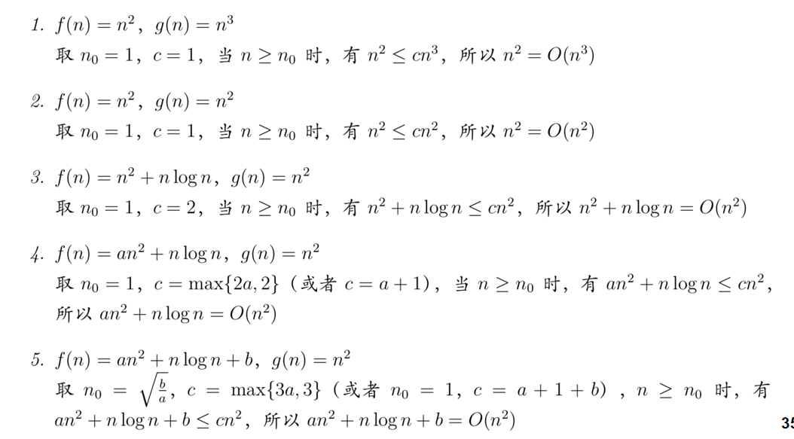
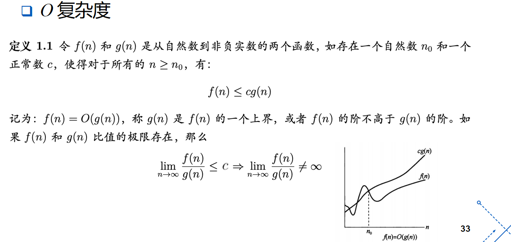
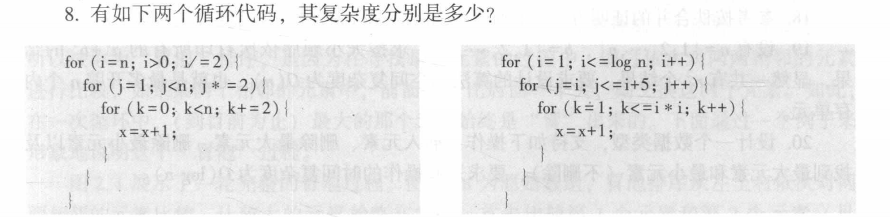
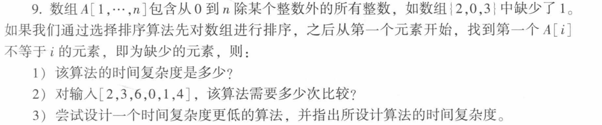
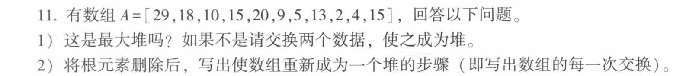
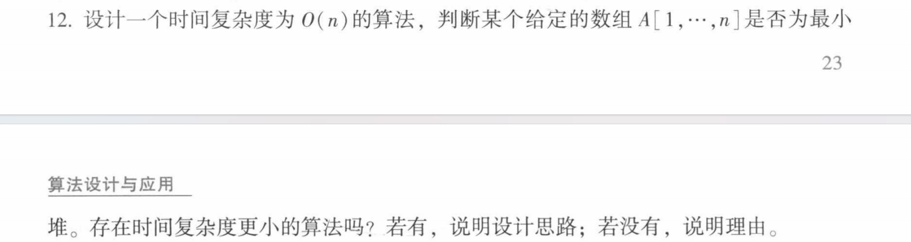
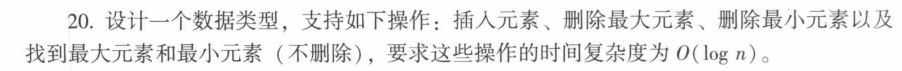

# 概述

## 知识点

### 算法的复杂度

- 时间复杂度 $T(n)$
    - 最坏时间复杂度
    - 最好时间复杂度
    - 平均时间复杂度

- 空间复杂度 $S(n)$
    - 空间复杂度不可能超过时间复杂度 $S(n) = O(T(n))$
    - 操作一个对象，最快的常数级时间 $T(1)$，最小空间开销也是原地操作 $S(1)$

### 渐近比较算法复杂度

关注两个参数 **正正常数** $c$**（或** $c_1, c_2$**）以及问题规模阈值** $n_0$

- $O$ **符号（渐近上界）**： 若存在正自然数 $n_0$ 和正正常数 $c$，使得对于所有的 $n \ge n_0$，都有 $f(n) \le cg(n)$，则记为 $f(n) = O(g(n))$
    - *实际意义*：给出了算法在规模充分大时的一个**上界**。上界的阶越低，评估越有价值。
    - $O$ 上界只用看最大的量项
- $\Omega$ **符号（渐近下界）**： 若存在正自然数 $n_0$ 和正正常数 $c$，使得对于所有的 $n \ge n_0$，都有 $f(n) \ge cg(n)$，则记为 $f(n) = \Omega(g(n))$。
    - *实际意义*：给出了算法复杂度的一个**下界**。估计的下界的阶越大越有价值。
- $\Theta$ **符号（渐近同阶）**： 若存在正自然数 $n_0$ 和正正常数 $c_1, c_2$，使得对于所有的 $n \ge n_0$，都有 $c_1g(n) \le f(n) \le c_2g(n)$，则记为 $f(n) = \Theta(g(n))$。
    - *等价条件*：当且仅当 $f(n) = \Omega(g(n))$ 且 $f(n) = O(g(n))$ 时，两函数同阶。
- $o$ **符号（非紧上界）**： 表示 $f(n)$ 的增长阶严格低于 $g(n)$ 的阶。



先确定常数，再定好相关的问题规模，转换成可以证明的不等式

### 渐进性质

渐近运算规则

- **加法规则**：$O(f(n)) + O(g(n)) = O(\max(f(n), g(n)))$
    - $O$ 分析的是算法的上界，先运算上界再相加；和先相加取上界再扩大规模是一样的
- **乘法规则**：$O(f(n)) \cdot O(g(n)) = O(f(n) \cdot g(n))$
    - 上界先取规模再运算和先运算再取规模是一眼更多
- **常数可忽略性**：$O(c \cdot f(n)) = O(f(n))$

- **自反性**：$f(n) = \Theta(f(n))$，$f(n) = O(f(n))$，$f(n) = \Omega(f(n))$。
- **对称性**：$f(n) = \Theta(g(n)) \iff g(n) = \Theta(f(n))$。
- **转置对称性**：$f(n) = O(g(n)) \iff g(n) = \Omega(f(n))$。
- **传递性**：若 $f(n) = O(g(n))$ 且 $g(n) = O(h(n))$，则 $f(n) = O(h(n))$（对 $\Theta, \Omega, o$ 同样适用）。


### 证明渐进复杂度

极限法：设 $f(n)$ 与 $g(n)$ 是非负实值函数，计算极限 $\lim_{n \to \infty} \frac{f(n)}{g(n)} = C$：

- **若** $C$ **为正正常数 (**$0 < C < \infty$**)**：说明两函数增长趋势完全一致，则 $f(n) = \Theta(g(n))$。由于同阶，自然满足 $f(n) = O(g(n))$ 且 $f(n) = \Omega(g(n))$。
- **若** $C = 0$：说明 $f(n)$ 增长慢于 $g(n)$，则 $f(n) = O(g(n))$（更准确地说是非紧上界 $f(n) = o(g(n))$）。
- **若** $C = \infty$：说明 $f(n)$ 增长快于 $g(n)$，则 $f(n) = \Omega(g(n))$。

定义法：从 $O$ 的证明入手，

- 先确定 $n_0$ 复杂度
- 再确定 $C$ 常数

### 具体代码中时间、空间复杂度的确定


## 堆

### 设计思路

- **普通队列（无序）**：插入非常快（直接放末尾，常数时间 $O(1)$），但每次找最值都必须遍历整个队列，耗时 $O(n)$。
- **已排序数组**：找最值极其简单（直接取端点值，常数时间 $O(1)$），但每次插入新元素为了维持有序性，需要移动大量元素，耗时 $O(n)$

堆的目的就是在数组的插入与排序  / 寻找中实现一个时间的 tradeoff

### 堆的结构

堆在拓扑结构上必须是一棵**完全二叉树**，具体有以下两个构成范例

- **堆序性（Heap Order）**：
    - **最大堆（Max Heap）**：任何一个父节点的值都**大于等于**其任意子节点的值。因此，根节点的值最大，且从根到任意叶子节点的路径上，键值是以非升序排列的。
    - **最小堆（Min Heap）**：任何一个父节点的值都**小于等于**其任意子节点的值，根节点值最小。

- 递归性：堆的任意子树也是一个有效的堆

堆的代码结构如下：**用一个数组** **a[1…n]** **来存储**

- **根节点**存储在首位 `a`。
- 对于任意存储在 `a[j]` 的节点 $x$（如果子节点存在）：
    - 其**左子节点**存放在 **a[2j]** 中。
    - 其**右子节点**存放在 **a[2j+1]** 中。
    - 任意非根节点 `a[j]` 的**父节点**，存放在 **a[⌊j/2⌋]** 中

### 堆的算法基础

1. 上移（Sift-up / 向上调整）

- **原理**：如果某个节点的键值大于其父节点（以最大堆为例），这就违背了堆序性。需要将该节点与父节点进行交换，然后沿着向上的路径重复此比较与交换过程，直到到达根节点，或者其父节点的值已经大于等于它为止。
- **时空复杂度**：由于完全二叉树的高度至多为 $\lfloor \log n \rfloor$，节点最多向上调整 $\log n$ 层。因此，时间复杂度为 $O(\log n)$，辅助空间复杂度为 $O(1)$。

2. 下移（Sift-down / 向下调整）

- **原理**：若某个内部节点 `a[i]`（其中 $i \le \lfloor n/2 \rfloor$）的键值小于其子节点的键值，违背了堆特性。调整时，需将该节点与它的左右子节点中**键值较大者**进行交换；交换后，该节点落在新的子树位置，可能继续违背规则，则沿着路径继续向下比较并交换，直至到达叶子节点或满足堆特性为止。
- **时空复杂度**：向下调整的最大深度同样受限于树高。时间复杂度为 $O(\log n)$，空间复杂度为 $O(1)$。

上移找父元素，下移找子元素

### 堆的操作

1. 插入新元素（Insert）

- **步骤**：先将新元素直接追加到一维数组的末尾 `a[n+1]`，此时完全二叉树结构完整，但可能破坏堆序性。因此紧接着对 `a[n+1]` 调用 `Sift-up`，令其向上游动到正确位置。
- **复杂度**：时间复杂度为 $O(\log n)$。

2. 删除指定元素（Delete）

- **步骤**：如果我们要删除堆中的某个元素 `a[i]`，**最直接的策略是用堆的最后一个元素 `a[n]` 去取代被删的 `a[i]`**。此时树结构依然完整。接着针对这个挪过来的新元素，视情况作调整：若它比其父节点大，则进行 `Sift-up`；若它比其儿子节点小，则进行 `Sift-down`。
- **复杂度**：时间复杂度为 $O(\log n)$

3. 快速建堆

- 自顶向下：从空堆开始，对 $n$ 个元素逐一调用 `Insert` 插入。这种方法相当于对每一层节点依次进行向上调整，其总时间复杂度为 $O(n \log n)$
- 自底向上：
    - **优化思路**：完全二叉树中，底层的叶子节点（占了约总节点数的一半，即下标为 $\lfloor n/2 \rfloor + 1$ 到 $n$ 的元素）本身就可以看作是合法的单节点堆，无需进行调整。
    - **算法设计**：我们只需从**最后一个非叶子节点** $i = \lfloor n/2 \rfloor$ 开始，往根节点方向（下行递减到 $1$）依次对每个节点调用 `Sift-down` 操作。

4. 堆排序

- **第一阶段**：通过调用 `makeheap(A)` 将无序数组构建成一个最大堆（耗时 $O(n)$）。
- **第二阶段**：循环 $n-1$ 次，每次将堆顶的最大元素（`a`）与堆当前的最后一个元素交换，从而将最大值“沉”到数组末尾；然后将堆的有效规模减 ，并对新的根节点调用 `Sift-down` 重新调整堆结构。
- **复杂度**：无论输入数据初始状态如何，建堆加上 $n-1$ 次调整的总时间复杂度在最好和最坏情况下都极其稳健，为 $\Theta(n \log n)$。
- **空间开销**：属于原地排序（In-place），空间复杂度为 $\Theta(1)$。
- **稳定性**：因为在元素交换和堆调整的过程中无法保证相同键值元素的相对位置不发生漂移，所以堆排序是**不稳定**的排序算法

## 作业




空间复杂度左右都是 $O(1)$ 

时间复杂度：

- 左边：
    - 外层 $O(log\;n)$
    - 中层$O(log\;n)$
    - 内层$O(n)$
    - 总共 $O(n\times({log\;n})^2)$

- 右边
    - 外层 $O(log\;n)$
    - 中层 $O(1)$
    - 内层 $O((log\;n)^2)$
    - 总共 $O((log\;n)^3)$



- 选择排序算法需要遍历一轮数组，时间$O(n^2)$，后续找出缺失的元素再遍历一次 $O(n)$，总体复杂度 $O(n^2)$

- 选择排序一定需要做 5*6/2 = 15 次，排序完得到 `[0, 1, 2, 3, 4, 6]`，再比较 6 次，一共 21 次

- 空间换时间，做两次遍历就行，也就是这里的排序实际上和找出缺失元素没有关系

    - 设置一个 `visited` 数组，保证 `visited[i] == false`, 随后遍历一次 `A` , 标记 

    - ```c
        visited[A[i]] = true
        ```

        时间 $O(n)$

    - 再遍历一次 `visited`，找到 `visited[j] == false` 的 j, 输出 `j` 即可

    - 总复杂度 $O(n)$

- 运算算法，运用子部分对于整体运算性质的影响

    - 先计算 $X_1 = 0 \oplus 1 \oplus 2 \oplus \dots \oplus n$ 
    - 再计算 $X_2 = A_1 \oplus A_2 \oplus \dots \oplus A_n$
    - $\text{missing} = X_1 \oplus X_2$
    - 时间 $O(n)$, 空间 $O(1)$



- 不是：18 的右子节点是 20， 比它大，交换 18， 20 后成为一个最大堆
- 删除 29， 也就是用 15 代替掉 29， 随后展开 down-shift
    - 15 小于 20， 交换 15 和 20
    - 15 小于 18， 交换 15 和 18
    - 最终目标堆为: `[20, 18, 10, 15, 15, 9, 5, 13, 2, 4]`



一共有 $\frac{n}{2}$ 个非叶子节点，那就遍历

- $i\; \text{in} \;1\sim \frac{n}{2}$
- $A[i] < A[2i] \quad\text{and}\quad A[i]<A[2i+1]$

- 有一个不满足就说明不是最小堆

---

最小堆的子堆一定是最小堆，考虑递归，从一个子节点展开，但事实从实现上来看，最小堆的性质由完整的全部元素影响，任何一个元素的更改总是会影响到最小堆的判断，也就是说起码要在规模上扫描一次所有数据，复杂度 $O(n)$



设置一个最小堆，但是只能满足增删改查最小元素，那么在内存中使用 $O(n)$ 的情况，维护两个数组（最大/最小堆），就可以了。

```Cpp
// 节点结构体定义
Structure HeapNode {
    val: ElementType      // 实际存储的数据值
    other_idx: Integer    // 该元素在另一个堆中的数组下标（索引）
}

// 双端优先队列结构体
Structure DoubleHeap {
    H_min: Array of HeapNode  // 最小堆数组（1-based 索引，大小为 n）
    H_max: Array of HeapNode  // 最大堆数组（1-based 索引，大小为 n）
    size: Integer             // 当前存储的元素个数
}

// 交换最小堆中的两个节点，并更新它们在最大堆中的反向索引
Procedure SwapMin(H_min, H_max, i, j) {
    // 1. 交换 H_min[i] 和 H_min[j] 两个节点
    temp = H_min[i]
    H_min[i] = H_min[j]
    H_min[j] = temp
    
    // 2. 更新这两个节点在最大堆中对应的反向指向
    idx_in_max_i = H_min[i].other_idx
    idx_in_max_j = H_min[j].other_idx
    H_max[idx_in_max_i].other_idx = i
    H_max[idx_in_max_j].other_idx = j
}

// 最小堆的向上调整
Procedure SiftUpMin(doubleHeap, i) {
    while i > 1 and doubleHeap.H_min[i].val < doubleHeap.H_min[⌊i/2⌋].val do
        SwapMin(doubleHeap.H_min, doubleHeap.H_max, i, ⌊i/2⌋)
        i = ⌊i/2⌋
    end while
}

// 最小堆的向下调整
Procedure SiftDownMin(doubleHeap, i) {
    n = doubleHeap.size
    while 2*i <= n do
        child = 2*i
        if child + 1 <= n and doubleHeap.H_min[child+1].val < doubleHeap.H_min[child].val then
            child = child + 1
        end if
        if doubleHeap.H_min[i].val <= doubleHeap.H_min[child].val then
            break
        end if
        SwapMin(doubleHeap.H_min, doubleHeap.H_max, i, child)
        i = child
    end while
}

// 交换最大堆中的两个节点，并更新它们在最小堆中的反向索引
Procedure SwapMax(H_min, H_max, i, j) {
    temp = H_max[i]
    H_max[i] = H_max[j]
    H_max[j] = temp
    
    idx_in_min_i = H_max[i].other_idx
    idx_in_min_j = H_max[j].other_idx
    H_min[idx_in_min_i].other_idx = i
    H_min[idx_in_min_j].other_idx = j
}

// 最大堆的向上调整
Procedure SiftUpMax(doubleHeap, i) {
    while i > 1 and doubleHeap.H_max[i].val > doubleHeap.H_max[⌊i/2⌋].val do
        SwapMax(doubleHeap.H_min, doubleHeap.H_max, i, ⌊i/2⌋)
        i = ⌊i/2⌋
    end while
}

// 最大堆的向下调整
Procedure SiftDownMax(doubleHeap, i) {
    n = doubleHeap.size
    while 2*i <= n do
        child = 2*i
        if child + 1 <= n and doubleHeap.H_max[child+1].val > doubleHeap.H_max[child].val then
            child = child + 1
        end if
        if doubleHeap.H_max[i].val >= doubleHeap.H_max[child].val then
            break
        end if
        SwapMax(doubleHeap.H_min, doubleHeap.H_max, i, child)
        i = child
    end while
}

Procedure Insert(doubleHeap, val) {
    doubleHeap.size = doubleHeap.size + 1
    n = doubleHeap.size
    
    // 创建新节点并存入两堆末尾，彼此指向对方的物理下标 n
    doubleHeap.H_min[n] = HeapNode(val, n)
    doubleHeap.H_max[n] = HeapNode(val, n)
    
    // 分别进行向上调整以维持堆序性
    SiftUpMin(doubleHeap, n)
    SiftUpMax(doubleHeap, n)
}

Function GetMin(doubleHeap) {
    if doubleHeap.size == 0 then return Error
    return doubleHeap.H_min[1].val
}

Function GetMax(doubleHeap) {
    if doubleHeap.size == 0 then return Error
    return doubleHeap.H_max[1].val
}

Procedure DeleteMin(doubleHeap) {
    if doubleHeap.size == 0 then return
    n = doubleHeap.size
    
    // 1. 获取最小元素在最大堆中的对应下标
    idx_in_max = doubleHeap.H_min[1].other_idx
    
    // 2. 在最小堆中删除根节点 (H_min[1])
    if n == 1 then
        doubleHeap.size = 0
        return
    end if
    
    // 用最小堆的最后一个元素覆盖根节点，并更新最大堆中对应的指向
    doubleHeap.H_min[1] = doubleHeap.H_min[n]
    corresponding_max_idx = doubleHeap.H_min[1].other_idx
    doubleHeap.H_max[corresponding_max_idx].other_idx = 1
    
    // 3. 在最大堆中删除对应的节点 (H_max[idx_in_max])
    // 如果被删除的刚好是最大堆的最后一个节点，直接丢弃即可
    if idx_in_max == n then
        doubleHeap.size = n - 1
        SiftDownMin(doubleHeap, 1) // 仅需调整最小堆
        return
    end if
    
    // 否则，用最大堆的最后一个元素覆盖被删位置
    doubleHeap.H_max[idx_in_max] = doubleHeap.H_max[n]
    corresponding_min_idx = doubleHeap.H_max[idx_in_max].other_idx
    doubleHeap.H_min[corresponding_min_idx].other_idx = idx_in_max
    
    // 缩小堆的有效规模
    doubleHeap.size = n - 1
    
    // 4. 分别对受影响的节点进行堆调整
    // 最小堆：根节点被替换，向下调整
    SiftDownMin(doubleHeap, 1)
    
    // 最大堆：中间某个节点被替换，需视情况向上或向下调整
    parent = ⌊idx_in_max / 2⌋
    if parent >= 1 and doubleHeap.H_max[idx_in_max].val > doubleHeap.H_max[parent].val then
        SiftUpMax(doubleHeap, idx_in_max)
    else
        SiftDownMax(doubleHeap, idx_in_max)
    end if
}

Procedure DeleteMax(doubleHeap) {
    if doubleHeap.size == 0 then return
    n = doubleHeap.size
    
    idx_in_min = doubleHeap.H_max[1].other_idx
    
    if n == 1 then
        doubleHeap.size = 0
        return
    end if
    
    // 在最大堆中删除根节点
    doubleHeap.H_max[1] = doubleHeap.H_max[n]
    corresponding_min_idx = doubleHeap.H_max[1].other_idx
    doubleHeap.H_min[corresponding_min_idx].other_idx = 1
    
    // 在最小堆中删除对应节点
    if idx_in_min == n then
        doubleHeap.size = n - 1
        SiftDownMax(doubleHeap, 1)
        return
    end if
    
    doubleHeap.H_min[idx_in_min] = doubleHeap.H_min[n]
    corresponding_max_idx = doubleHeap.H_min[idx_in_min].other_idx
    doubleHeap.H_max[corresponding_max_idx].other_idx = idx_in_min
    
    doubleHeap.H_size = n - 1
    
    // 重新调整两堆
    SiftDownMax(doubleHeap, 1)
    
    parent = ⌊idx_in_min / 2⌋
    if parent >= 1 and doubleHeap.H_min[idx_in_min].val < doubleHeap.H_min[parent].val then
        SiftUpMin(doubleHeap, idx_in_min)
    else
        SiftDownMin(doubleHeap, idx_in_min)
    end if
}

```


