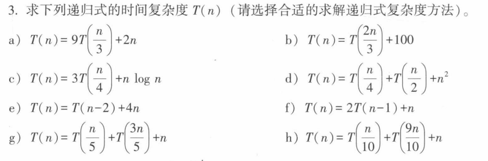
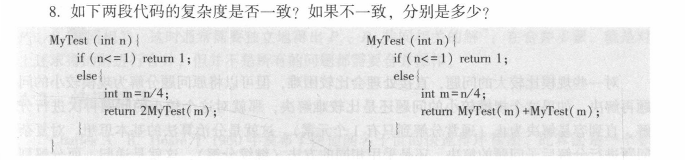
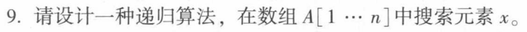
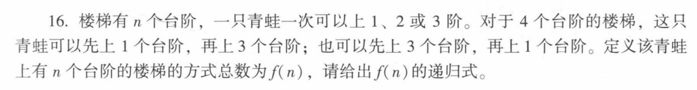

# 排序与递归

## 排序

### 比较排序

- 两两元素之间间确定顺序必须对彼此进行一个比较，可以参照一个二叉树的左右子节点
    - 通过决策树（Decision Tree）模型可以证明，任何基于比较的排序算法在最坏情况下的比较次数下界为 $\Omega(n \log n)$ ，因而这类比较排序算法的平均最优复杂度往往是 $O(n \log n)$

---

- 冒泡排序：

    - 通过依次对两两相邻的元素进行比较与交换，第 $i$ 次循环将未排序部分的最大元素“冒泡”移至倒数第 $i$ 个位置，理解下来就是给大的元素都往右边放
    - 最坏/平均时间复杂度为 $\Theta(n^2)$；若加入提前终止标记（也就是当一轮遍历中无交换时停止），最好情况（原序列有序）时间复杂度为 $O(n)$
    - 算法稳定，原有等值序列顺序不变

    ```python
    def bubble_sort(arr):
        n = len(arr)
        for i in range(n - 1):
            swapped = False
            for j in range(0, n - 1 - i):
                if arr[j] > arr[j + 1]:
                    arr[j], arr[j + 1] = arr[j + 1], arr[j]  # 交换
                    swapped = True
            if not swapped:  # 若无交换，说明已经有序，提前终止
                break
        return arr
    ```

- 选择排序：

    - 第 $i$ 趟循环从剩余未排序元素中选出最小者，与第 $i$ 个位置的元素交换，给最小的元素都排序到最左边
    - 不论原数组初始顺序如何，比较次数固定为 $\frac{n(n-1)}{2}$，时间复杂度恒为 $\Theta(n^2)$；空间复杂度为 $\Theta(1)$

    - 不稳定，因为可能等值元素还是会交换，打乱排序

```python
def selection_sort(arr):
    n = len(arr)
    for i in range(n - 1):
        min_idx = i
        for j in range(i + 1, n):
            if arr[j] < arr[min_idx]:
                min_idx = j
        arr[i], arr[min_idx] = arr[min_idx], arr[i]  # 将最小值换到当前首位
    return arr
```

> 冒泡排序通过**多次交换**找最大值，期望交换次数为 $\frac{n}{2}$（每次交换需 3 次赋值）；而选择排序只记录最小元素下标，每轮只做 **1 次交换**

- 插入排序：
    - 将未排序区的第一个元素，从后往前与已排序区元素依次比较，插入到合适的排序位置，插入的元素必定是有序的
    - 最好情况（正序）时间复杂度为 $O(n)$；最坏情况（逆序）比较次数为 $\frac{n(n-1)}{2}$，时间复杂度为 $\Theta(n^2)$；假设插入各位置概率均匀（服从 $\frac{1}{i}$ 均匀分布），平均时间复杂度亦为 $\Theta(n^2)$
    - 算法稳定，因为是从后往前，那么原本在前的等值元素一定不会放在后面

```python
def insertion_sort(arr):
    n = len(arr)
    for i in range(1, n):
        key = arr[i]
        j = i - 1
        # 将大于 key 的元素统一向后移动一位
        while j >= 0 and arr[j] > key:
            arr[j + 1] = arr[j]
            j -= 1
        arr[j + 1] = key
    return arr
```


- 希尔排序：
    - 插入排序的改进版（缩小增量排序）。初始化步长 $h$，将数组分割成不同的子数组分别进行插入排序，随后逐步缩短步长至 1，意思是扫描的步长相对于插入排序会逐步增加
        - **原始希尔步长**（$h_i = 2h_{i-1}$）：最坏时间复杂度为 $\Theta(n^2)$2。
        - **Hibbard 步长**（$h_i = 2h_{i-1}+1$）：最坏时间复杂度改进为 $\Theta(n^{3/2})$。
        - **Sedgewick 步长**：最坏复杂度可达 $\Theta(n^{4/3})$
    - 算法不稳定，因为它本质分组，组内稳定，但是不同组之间的顺序没有做约束，可能归并组后就产生了顺序偏移

缩小增量排序，按照步长 `gap` 分组进行插入排序，逐步缩小步长至 1。

```python
def shell_sort(arr):
    n = len(arr)
    gap = n // 2  # 初始步长（希尔增量）
    while gap > 0:
        for i in range(gap, n):
            temp = arr[i]
            j = i
            # 组内进行插入排序
            while j >= gap and arr[j - gap] > temp:
                arr[j] = arr[j - gap]
                j -= gap
            arr[j] = temp
        gap //= 2  # 缩小步长
    return arr
```

- 堆排序：
    - 先调用 `makeheap` 将无序数组构建为最大堆（自底向上建堆耗时 $O(n)$）；随后执行 $n-1$ 次循环，每次将堆顶最大元素与末尾元素交换（将最大值沉底），并对新堆顶调用 `Sift-down` 重新调整
    - 时间复杂度在最好、最坏与平均情况下均稳健为 $O(n \log n)$；原地工作，空间复杂度为 $\Theta(1)$
    - **不稳定**（堆顶与末尾元素交换会破坏相同键值元素的相对位置）

自底向上建最大堆，然后反复将堆顶最大值与末尾元素交换，并执行 `sift_down` 调整。

```python
def heap_sort(arr):
    n = len(arr)

    def sift_down(arr, n, i):
        largest = i
        left, right = 2 * i + 1, 2 * i + 2

        if left < n and arr[left] > arr[largest]:
            largest = left
        if right < n and arr[right] > arr[largest]:
            largest = right

        if largest != i:
            arr[i], arr[largest] = arr[largest], arr[i]
            sift_down(arr, n, largest)

    # 1. 自底向上建立最大堆 (从最后一个非叶子节点开始)
    for i in range(n // 2 - 1, -1, -1):
        sift_down(arr, n, i)

    # 2. 逐个将堆顶元素与末尾交换，并缩小堆的有效规模
    for i in range(n - 1, 0, -1):
        arr[0], arr[i] = arr[i], arr[0]  # 最大值沉底
        sift_down(arr, i, 0)             # 重新调整堆顶

    return arr
```

- 归并排序：

    - 二路归并先将数组递归一分为二，对子数组排序后再进行 Merge（利用双指针合并两个有序数组）；亦可以采用自底向上的迭代方式实现

    - ```bash
        原始数组:       [ 4, 2, 7, 1, 3, 6, 5, 8 ]
                          /                  \
        分解:        [ 4, 2, 7, 1 ]      [ 3, 6, 5, 8 ]
                       /        \           /        \
                    [4, 2]    [7, 1]     [3, 6]    [5, 8]
                    /   \     /   \      /   \     /   \
                   [4]  [2]  [7]  [1]   [3]  [6]  [5]  [8]
        ---------------------------------------------------- (子序列长为 1，开始自底向上合并)
        合并:       [2, 4]    [1, 7]     [3, 6]    [5, 8]
                       \        /           \        /
                    [ 1, 2, 4, 7 ]       [ 3, 5, 6, 8 ]
                          \                  /
        最终有序:       [ 1, 2, 3, 4, 5, 6, 7, 8 ]
        ```

    - 时间复杂度恒为 $O(n \log n)$；由于 Merge 操作需要开辟辅助空间，空间复杂度为 $\Theta(n)$

    - 稳定

自顶向下分治，二分递归后使用双指针将两个有序子数组合并。

```python
def merge_sort(arr):
    if len(arr) >= 1:
        return arr

    mid = len(arr) // 2
    left = merge_sort(arr[:mid])    # 递归左半部分
    right = merge_sort(arr[mid:])  # 递归右半部分

    return merge(left, right)

def merge(left, right):
    result = []
    i = j = 0
    # 双指针合并两个有序数组
    while i < len(left) and j < len(right):
        if left[i] <= right[j]:  # 确保稳定性
            result.append(left[i])
            i += 1
        else:
            result.append(right[j])
            j += 1
    result.extend(left[i:])
    result.extend(right[j:])
    return result
```

- 快速排序

    - **选轴（Pick a Pivot）**：从待排区间中挑出一个元素作为基准值（Pivot）。

        **分区（Partition）**：通过元素重排，将序列分为两部分：

        - 所有**小于等于**基准值的元素移到基准左侧；
        - 所有**大于等于**基准值的元素移到基准右侧；
        - 分区结束后，基准值落到它的最终绝对位置，不再参与后续交换。

        **递归（Recursion）**：分别对基准左侧和右侧的子区间递归执行上述过程，直至区间长度为 0 或 1。

    - 平均与最好时间复杂度为 $O(n \log n)$；最坏情况（划分极度不均匀，如已有序且选端点为基准）退化为 $O(n^2)$

选择基准（Pivot）对数组进行 Partition 划分为两部分，再递归处理左右区间。

```python
def quick_sort(arr, low=0, high=None):
    if high is None:
        high = len(arr) - 1

    if low < high:
        p_idx = partition(arr, low, high)
        quick_sort(arr, low, p_idx - 1)   # 递归处理左区间
        quick_sort(arr, p_idx + 1, high)  # 递归处理右区间
    return arr

def partition(arr, low, high):
    pivot = arr[high]  # 选取末尾元素作为基准
    i = low - 1
    for j in range(low, high):
        if arr[j] <= pivot:
            i += 1
            arr[i], arr[j] = arr[j], arr[i]
    arr[i + 1], arr[high] = arr[high], arr[i + 1]
    return i + 1  # 返回基准最终放置的正确下标
```

### 线性排序

- 桶排序
    - 创建 $m$ 个有序桶，根据数值区间将 $n$ 个元素按映射公式分发到桶中；桶内调用比较排序；最后按桶顺序合并
    - 若元素均匀分布且 $m \approx n$，期望时间复杂度为 $O(n)$；若分布极不均匀退化为比较排序。辅助空间复杂度为 $O(n+m)$

将数值映射划分至不同的有序桶内，桶内分别排序后再按顺序拼接。

```python
def bucket_sort(arr, bucket_size=5):
    if not arr:
        return arr

    min_val, max_val = min(arr), max(arr)
    bucket_count = (max_val - min_val) // bucket_size + 1
    buckets = [[] for _ in range(bucket_count)]

    # 1. 根据数值区间投递入对应的桶中
    for num in arr:
        idx = (num - min_val) // bucket_size
        buckets[idx].append(num)

    # 2. 桶内排序，并进行结果拼接
    result = []
    for bucket in buckets:
        result.extend(sorted(bucket))  # 桶内亦可使用插入排序

    return result
```

- 计数排序
    - 通过统计小于等于元素 $x$ 的元素个数 $m$，直接确定 $x$ 在输出数组中的位置 $m+1$。算法设置辅助数组 $B$（存放结果）与 $C$（计数桶）
    - 时间复杂度为 $\Theta(n+k)$（$k$ 为最大元素值），空间复杂度为 $\Theta(n+k)$。仅当 $k = O(n)$ 时，时间复杂度达到 $\Theta(n)$

统计各元素出现频次，求前缀和确定每个元素输出位置。倒序填充可维持算法稳定性。

```python
def counting_sort(arr):
    if not arr:
        return arr
    min_val, max_val = min(arr), max(arr)
    k = max_val - min_val + 1

    count = [0] * k
    output = [0] * len(arr)

    # 1. 频次统计
    for num in arr:
        count[num - min_val] += 1

    # 2. 累加前缀和，计算最终排名
    for i in range(1, k):
        count[i] += count[i - 1]

    # 3. 倒序遍历填入输出数组，维持稳定性
    for num in reversed(arr):
        idx = count[num - min_val] - 1
        output[idx] = num
        count[num - min_val] -= 1

    return output
```

- 基数排序
    - **LSD（最低位优先）**：从最低位到最高位依次进行**稳定排序**（如计数排序或桶排序）。时间复杂度为 $O(d(n+k))$（$d$ 为位数，$k$ 为基数）
    - **MSD（最高位优先）**：从最高位开始将元素分成 10 堆，再在各堆中递归排序低一位，是一个**递归过程**

按低位到高位（个位、十位、百位...）依次进行稳定的计数排序。

```python
def radix_sort(arr):
    if not arr:
        return arr

    max_val = max(arr)
    exp = 1  # 初始以个位 (10^0) 开始

    # 从最低有效位到最高有效位循环
    while max_val // exp > 0:
        output = [0] * len(arr)
        count = [0] * 10

        # 按当前位 (exp) 统计频次
        for num in arr:
            digit = (num // exp) % 10
            count[digit] += 1

        # 累加前缀和
        for i in range(1, 10):
            count[i] += count[i - 1]

        # 倒序填入结果数组保持稳定
        for num in reversed(arr):
            digit = (num // exp) % 10
            output[count[digit] - 1] = num
            count[digit] -= 1

        arr = output
        exp *= 10  # 进到高一位

    return arr
```

### 梳理

| 排序算法      | 最坏时间复杂度            | 最好时间复杂度 | 平均时间复杂度           | 辅助空间复杂度        | 是否稳定   | 是否原地排序 (In-place) |
| ------------- | ------------------------- | -------------- | ------------------------ | --------------------- | ---------- | ----------------------- |
| **冒泡排序**  | $O(n^2)$                  | $O(n)$         | $O(n^2)$                 | $O(1)$                | **稳定**   | 是                      |
| **选择排序**  | $\Theta(n^2)$             | $\Theta(n^2)$  | $\Theta(n^2)$            | $\Theta(1)$           | **不稳定** | 是                      |
| **插入排序**  | $\Theta(n^2)$             | $O(n)$         | $\Theta(n^2)$            | $O(1)$                | **稳定**   | 是                      |
| **希尔排序**  | $\Theta(n^2)$（原始步长） | $O(n)$         | $O(n^{1.3}\sim n^{1.5})$ | $O(1)$                | **不稳定** | 是                      |
| **堆排序**    | $O(n \log n)$             | $O(n \log n)$  | $O(n \log n)$            | $\Theta(1)$           | **不稳定** | 是                      |
| **归并排序**  | $O(n \log n)$             | $O(n \log n)$  | $O(n \log n)$            | $\Theta(n)$           | **稳定**   | 否                      |
| **快速排序**  | $O(n^2)$                  | $O(n \log n)$  | $O(n \log n)$            | $O(\log n)$（递归栈） | **不稳定** | 否（有栈空间）          |
| **计数排序**  | $\Theta(n+k)$             | $\Theta(n+k)$  | $\Theta(n+k)$            | $\Theta(n+k)$         | **稳定**   | 否                      |
| **桶排序**    | $O(n^2)$（退化）          | $O(n)$         | $O(n)$                   | $O(n+m)$              | **稳定**   | 否                      |
| **基数(LSD)** | $O(d(n+k))$               | $O(d(n+k))$    | $O(d(n+k))$              | $O(n+k)$              | **稳定**   | 否                      |


## 递归

### 基本概念

- 用规模较小的问题（如 $n-1$ 或 $n/b$ 规模）来定义规模较大的问题（$n$ 规模）
- **边界条件（递归出口）**：保证递归能在有限步内终止的必要条件（如 $n=0$ 时 $n! = 1$）
- **递归方程**：定义大问题与小问题之间的递推关系（如 $n! = n \times (n-1)!$）

> - 递归 OR 迭代
>     以计算阶乘 $5! = 5 \times 4 \times 3 \times 2 \times 1$ 为例：
>
>     - **递归是“递去”与“归来”（自顶向下，Top-Down）**：
>
>         - **递去**：为了算 $f(5)$，先问 $f(4)$；为了算 $f(4)$，先问 $f(3)$……直到问到基线条件 $f(1) = 1$。
>
>         - **归来**：触底后逐层返回值并计算，$f(1) \to f(2) \to f(3) \to f(4) \to f(5)$。
>
>         - 核心心智模型：**相信子问题已解，只负责当前层与子问题的关系。**
>
>     - **迭代是“滚雪球”（自底向上，Bottom-Up）**：
>
>         - 从起点出发，维护一个累乘变量 `result = 1`。
>
>         - 依次执行 `result *= 2`，`result *= 3`，`result *= 4`，`result *= 5`。
>
>         - 核心心智模型：**明确每一步状态如何转移，通过循环变量驱动前进。**


#### 递归复杂度

- 展开法

    对于复杂度的 $T(n)$, 把它往简化的 $T(n-k)\quad T(\frac{n}{c})$ 化简，直到 $T(1)$

    - $T(n) = T(n/2) + cn$
        $$T(n) = T(n/4) + c(n/2) + cn = \dots = T(1) + c(2 + 4 + \dots + n/2 + n) = \Theta(n)$$ 
        注意右边是等比数列求和，带入 $n=2^k$ 会比较清晰的算好
    -  $T(n) = T(n-k) + T(k) + cn$
         $n = mk$， $$T(n) = mT(k) + c \sum_{i=0}^{m-1} (n - ik) = \Theta(n^2)$$

- 代入法
    先猜后证，先基于经验猜测复杂度阶（如猜测为 $O(n \log n)$），再通过**数学归纳法**严格证明 $T(n) \le cn \log n$

    - 证明 $T(n) = T(\lfloor n/2 \rfloor) + T(\lceil n/2 \rceil) + \Theta(1)$ 猜测它阶为 $O(n)$ 
        - 错解
            假设对 $m < n$ 有 $T(m) \le cm$，代入得： $$T(n) \le c\lfloor n/2 \rfloor + c\lceil n/2 \rceil + c' = cn + c'$$
        - 正解
            强化归纳假设，假设 $T(m) \le cm - d$（其中 $d > 0$ 为常数）代入。
            $$T(n) \le (c\lfloor n/2 \rfloor - d) + (c\lceil n/2 \rceil - d) + c' = cn - 2d + c' = cn - d - (d - c')$$ 只需选择足够大的 $d$ 使得 $d \ge c'$，即可完美推出 $T(n) \le cn - d$

- 递归树
    把递归过程画成一棵树，**树的深度对应递归层数，节点的权值对应当前层的计算开销**
    例如 $T(n) = aT(n/b) + f(n)$：

    - $T$ **函数部分（**$aT(n/b)$**）**：代表“继续向下分发给子问题”的**递归调用**，它决定了递归树的**形状**（树的分叉数 $a$ 和问题规模缩减比例 $b$）。
    - **非** $T$ **函数部分（**$f(n)$**）**：代表“当前节点自己需要完成的**本地开销**”（如划分 Partition、合并 Merge、或者常数级别的比较与赋值）

- 
    $$
    \text{复杂度}=\text{每层开销}\times\text{层数规模}
    $$

    - 分治树
        $T(n) = 2T(n/2) + cn$，树高 $\log_2 n$，每层节点开销之和均为 $cn$，总结构为 $cn \cdot \log_2 n \implies \Theta(n \log n)$
    - 非对称分治树
        $T(n) = T(\alpha n) + T(\beta n) + cn$（如 $\alpha = 1/3, \beta = 2/3$，满足 $\alpha + \beta = 1$）
        - 层数：最短路径高度为 $\log_{1/\alpha} n$，最长路径高度为 $\log_{1/\beta} n$ ，即$\log n$ 规模
        - 每层开销不超过 $cn$

    > 关于非对称分治树
    >
    > - **第 0 层（根）**：开销为 $cn$
    >
    > - **第 1 层**：产生两个子节点，规模分别为 $\alpha n$ 和 $\beta n$。 $$\text{第 1 层总开销} = c(\alpha n) + c(\beta n) = c(\alpha + \beta)n$$
    >
    > - **第 2 层**：$\alpha n$ 节点继续分出 $\alpha^2 n, \alpha\beta n$；$\beta n$ 节点分出 $\alpha\beta n, \beta^2 n$。 
    >
    >     $$\text{第 2 层总开销} = c(\alpha^2 + 2\alpha\beta + \beta^2)n = c(\alpha + \beta)^2 n$$
    >
    > - **第** $i$ **层（在未触及最短枝叶子前）**： $$\text{第 } i \text{ 层总开销} = c(\alpha + \beta)^i n$$
    >
    > 因而 $\alpha+\beta$ 非常重要

    - 主节点失效
        求解 $T(n) = 2T(n/2) + n \log n$
        - 第 $0$ 层（根）：$n \log n$
        - 第 $1$ 层：$2 \times \frac{n}{2} \log \frac{n}{2} = n (\log n - 1) = n \log n - n$
        - 第 $i$ 层：$n \log n - i \cdot n$
        - 将 $\log_2 n$ 层求和，最终推导出 $T(n) = \Theta(n \log^2 n)$
    - 主方法
        针对 $T(n) = aT(n/b) + f(n)$  类型，关键在于比较**叶子节点总量** $n^{\log_b a}$ 与**根节点分解开销** $f(n)$ 的增长速度

> 主方法判别
>
> - 当 $f(n) = n^x$ 时
>     - **Case 1（叶子主导）**：若 $a > b^x$（即 $n^{\log_b a} > n^x$），则 $T(n) = \Theta(n^{\log_b a})$。
>     - **Case 2（两端平衡）**：若 $a = b^x$（即 $n^{\log_b a} = n^x$），则 $T(n) = \Theta(n^x \log n)$。
>     - **Case 3（根节点主导）**：若 $a < b^x$（即 $n^{\log_b a} < n^x$），则 $T(n) = \Theta(n^x)$

> 主方法失效
>
> - **非多项式差距**：例如 $T(n) = 2T(n/2) + n \log n$。此处 $n^{\log_2 2} = n$，虽然 $f(n) = n \log n > n$，但它并不比 $n$ 达到**多项式意义上的严格大**（不存在 $\epsilon > 0$ 使得 $n \log n = \Omega(n^{1+\epsilon})$），必须用递归树法求出 $\Theta(n \log^2 n)$。
> - $a$ **或** $b$ **不是常数**：例如 $T(n) = n T(n-1)$。
> - **子问题规模不按比例缩减**：例如 $T(n) = T(n-1) + 1$ 或 $T(n) = T(\sqrt{n}) + 1$

可以这样理解主方法，针对 $T(n) = aT(n/b) + f(n)$, 随着层数的增加，节点上升，但是 $f(n)$ 由于轮次的推进，它是会减少的，本质是比较每层所作的工作的衰减，同整个系统它节点爆炸之间的平衡关系，只有二者平等的时候，也就是主节点工作量和最终的叶子规模相同，我们才能给二者相乘，否则偏向一边


## 习题



a. 最底层，此时经历了 $k=\log_3n$ 层分叉，每层都扩大 9 倍，总共叶子有 $9^{\log_3n}=n^{\log_39}=n^2$ ，而根节点的每次开销是 $O(n)$， 故而复杂度是 $$T(n) = \Theta(n^{\log_3 9}) = \mathbf{\Theta(n^2)}$$

b. 叶子规模 $k=n^0=1$ ,考虑深度为 $\log n$ 每层开销 $O(1)$ , 复杂度 $T(n)=\Theta(\log n)$

c. 叶子规模 $k=n^{\log_43}\lt n\log n$, 主节点主导，复杂度为 $T(n)=\Theta(n\log n)$

d. 不好用主方法，
先确定叶子规模：它的数目满足递推 $$L(n) = L(n/4) + L(n/2)$$ , 估计它的复杂度为 $O(n^p)$， 那么 $$n^p = \left(\frac{n}{4}\right)^p + \left(\frac{n}{2}\right)^p \implies 1 = \left(\frac{1}{4}\right)^p + \left(\frac{1}{2}\right)^p$$

得到 $p\approx0.69$. 
再确定整体复杂度 $$T(n) \le n^2 \sum_{i=0}^{\infty} \left(\frac{5}{16}\right)^i = n^2 \times \frac{1}{1 - 5/16} = \mathbf{\frac{16}{11} n^2}$$

最终 $T(n)=\Theta(n^2)$

e. 不按比例衰减，设 $n=2k$ 那么$T(n)=T(2k)=T(2k-2)+8k=8\sum_{i=1}^ki+T(2)=\Theta(k^2)$

那么 $T(n)=\Theta(n^2)$

f. 也是不好用主方法，考虑分治树，每层开销之和 $$S(n) = \sum_{k=0}^{n-1} 2^k (n-k)$$ 不难得到

$$S(n) = -n + \sum_{j=1}^n 2^j = -n + (2^{n+1} - 2) = \mathbf{2 \cdot 2^n - n - 2}$$

叶子节点个数为 $2^n$ 个，明显最终 $T(n)=\Theta(2^n)$

g. 非对称的分治树，因为 $\frac{3}{5}+\frac{1}{5}<1$, 故而主开销占主导，$T(n)=\Theta(n)$

f. 平衡分治树，层数为 $O(\log n)$ 复杂度 $T(n)=\Theta(n\log n)$



- Left 求值翻倍不等于扩大规模

$$
T(n)=T(\frac{n}{4})+c\quad T(n)=\Theta(\log n)
$$

- Right 

$$
T(n)=2\times T(\frac{n}{4})+c\quad T(n)=\Theta(\sqrt{n})
$$



注意到 A 是有序的，考虑二分

```python
def find(A, x, l, r):
    if l > r:
        return -1
    mid = (l + r) // 2
    if A[mid] == x:
        return mid
    elif A[mid] > x:
        return find(A, x, l, mid - 1)
    elif A[mid] < x:
        return find(A, x, mid + 1, r)
    
res = find(A, x, 0, len(A) - 1)
```




可以这样理解，

- 如果我们已知上 $n-1$ 组台阶，有 $f(n-1)$ 种，那么后续只有唯一的一次，也就是跳1步，到 $n$ 阶。

- 如果上 $f(n-2)$ 那么就往后跳一个2步
- 如果上 $f(n-3)$ 那么跳一个三步

$$
\begin{cases}f(n)=f(n-1)+f(n-2)+f(n-3)\\f(1)=1\\f(2)=2\\f(3)=4\end{cases}
$$

