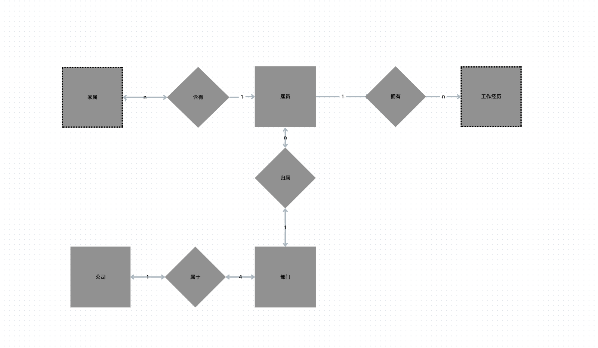
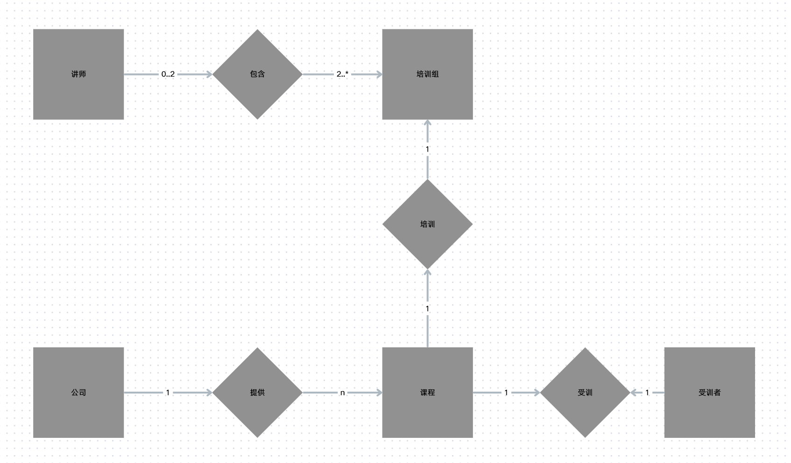
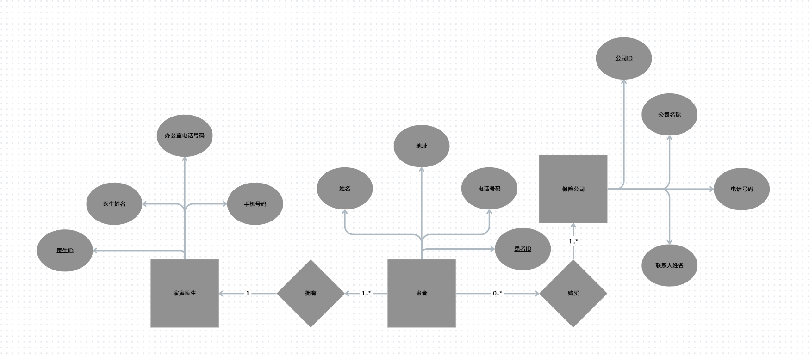
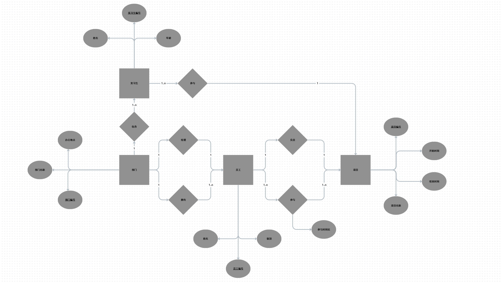
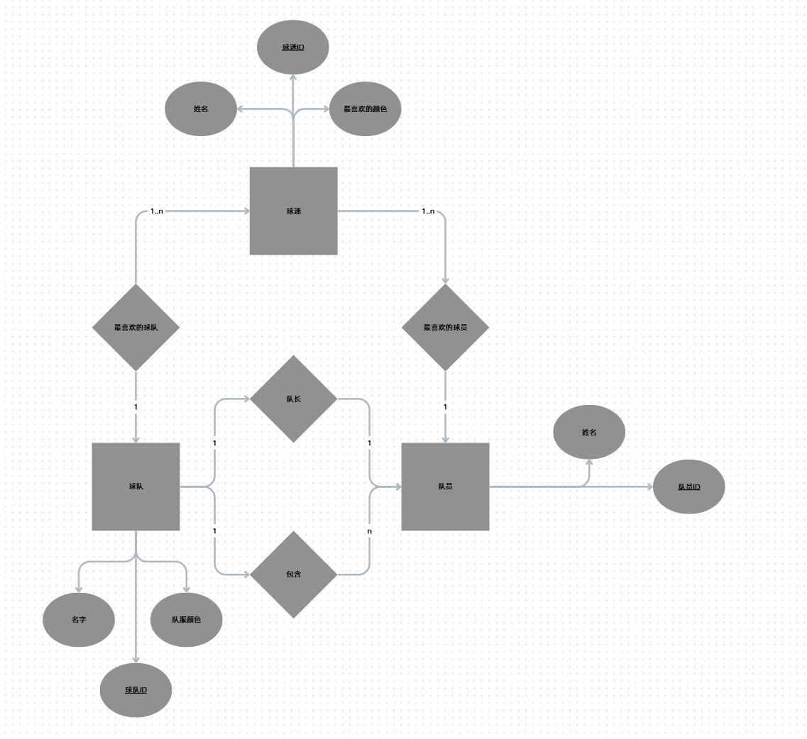

# 第十周作业

## 概念简答

> 简述数据库设计的基本步骤

分为

- 需求分析
    自顶向下

- 概念结构的设计
    自底向上
- 逻辑结构的设计
    E-R图 -> 一般数据模型 -> 特定DBMS数据模型 -> 优化数据模型 -> 设计用户子模式
- 物理结构的设计
    确定物理结构并进行评价
- 数据库实施
- 数据库运行与维护

> 简述需求分析阶段的任务和方法

- 任务

    自顶向下地进行分析，充分了解原系统工作概况，明确系统的各种需求（信息要求、处理要求、安全性与完整性要求），然后在此基础上确定新系统的功能

- 方法/步骤
    - 调查组织机构
    - 调查各部门的业务活动情况
    - 明确用户需求
    - 计算机应用现状
    - 确定新系统的边界

> 什么是数据库的逻辑结构设计?简述其设计步骤

- 概念
    把概念结构阶段设计好的基本E-R图转换为与选用DBMS产品所支持的数据模型相符合的逻辑结构

- 设计步骤
    E-R图 -> 一般数据模型 -> 特定DBMS数据模型 -> 优化数据模型 -> 设计用户子模式

> 规范化对数据库设计有什么指导意义?

- 提供理论基础
- 减少冗余与异常
- 提供模式分解步骤及其标准
- 确保设计的等价性

> 简述将E-R图转换为关系模型的一般规则

- 基础结构的对应
    - **实体**转换为**表**
    - **简单属性**转换为表的**列**
    - **复合属性**转换为组成该复合属性的**简单属性集**
    - **多值属性**转换为**表和外键**
    - **关键字属性**转换为**主键**
    - **1:1 或 1:N 联系**通常通过**外键**隐含地表示
    - **M:N 联系**转换为**联系表和两个外键**
    - **n元联系**转换为**联系表和n个外键**
- 遵循9步算法
    - Step 1：强实体的转换
    - Step 2：仅参与一个1:1联系的弱实体的转换
    - Step 3：参与1:N或M:N联系的弱实体的转换
    - Step 4：1:1 联系的转换
    - Step 5：1:N 联系的转换
    - Step 6：N元联系（包括M:N联系）
    - Step 7：多值属性的转换
    - Step 8：具有强制参与且不相交的超类/子类联系的转换
    - Step 9：具有相交子类或可选参与且不相交的超类/子类联系的转换

## 综合应用

> 为下面的描述建立ER图:
>
> - 一个公司有四个部门，每个部门属于一个公司。
> - 每个部门有一或多名雇员，每名雇员在一个部门工作。
> - 每名雇员可能有一名或多名家属，每个家属属于一名雇员。
> - 每名雇员可能有工作经历

注意以下 家属和工作经历是弱实体 用虚线矩形画即可

> 将ER图转换为关系模式，并指明所有候选键、主键和外键

**公司 (Company)**

- 关系模式：公司 ( **公司编号**, 公司名称... )

**部门 (Department)**

- 关系模式：部门 ( **部门编号**, 部门名称..., ***公司编号\*** )
- 外键：`公司编号` 引用自「公司」表。

**雇员 (Employee)**

- 关系模式：雇员 ( **雇员编号**, 姓名..., ***部门编号\*** )
- 外键：`部门编号` 引用自「部门」表。

**家属 (Dependent)** —— *弱实体转换*

- 关系模式：家属 ( ***雇员编号\*, 家属编号/姓名**, 与雇员关系... )
- 主键：`(雇员编号, 家属编号/姓名)` 构成的复合主键。
- 外键：`雇员编号` 引用自「雇员」表。

**工作经历 (Work_Experience)** —— *弱实体转换*

- 关系模式：工作经历 ( ***雇员编号\*, 经历序号**, 开始时间, 结束时间, 公司名... )
- 主键：`(雇员编号, 经历序号)` 构成的复合主键。
- 外键：`雇员编号` 引用自「雇员」表。

> 现在需要为一家从事IT培训的公司建立一个概念数据模型，来满足该公司的数据需求。
> 公司有30名讲师，每期培训课程可以有100名受训者。该公司提供五门高级技术课程，每门课程由一个培训组进行培训，该培训组有两名或更多讲师。每名讲师最多只能同时分派到两个培训组中或分派从事研究工作。每名受训者在每期培训中都要学习一门高级技术课程。
> 请完成下列任务:
> (1)确定该公司的主要实体类型
> (2)确定主要联系类型和每个联系的多样性，声明对数据所做的假设。
> (3)使用(1)和(2)中得到的结果，画出表示该公司数据需求的ER图。

1. 主要实体

    - 公司
    - 培训课程/技术课程
    - 培训组
    - 讲师
    - 受训者

    均为强实体

2. 数据联系
    - 公司提供课程 
    - 课程和培训组一一对应
    - 培训组分配讲师
    - 受训者参与课程

3. 都在一期培训中 建立如下E-R图
    关键在于讲师和培训组的数量对应 
    - 一个讲师可以对应0 1 2个培训组
    - 一个培训组可以有 2 ~ * 讲师

> 将ER图转换为关系模式，并指明所有候选键、主键和外键

**课程 (Course)**

- 关系模式：课程 ( **课程编号**, 课程名称, )

**培训组 (Training_Group)**

- 关系模式：培训组 ( **培训组编号**, ***课程编号\*** )
- 外键：`课程编号` 引用自「课程」表（处理课程与培训组的 1:1 或 1:N 联系）。

**受训者 (Trainee)**

- 关系模式：受训者 ( **受训者编号**, 姓名, ***学习课程编号\*** )
- 外键：`学习课程编号` 引用自「课程」表（每名受训者学习一门课程 N:1）。

**讲师 (Instructor)**

- 关系模式：讲师 ( **讲师编号**, 姓名 )

**培训分配 (Group_Instructor_Allocation)** —— *处理讲师与培训组的 M:N 联系*

- 关系模式：培训分配 ( ***讲师编号\*, \*培训组编号\*** )
- 主键：`(讲师编号, 培训组编号)` 构成的复合主键。
- 外键：`讲师编号` 引用自「讲师」表，`培训组编号` 引用自「培训组」表。

>  U.R.Sick是一家综合医院的管理员。他希望为医院的门诊诊所建立一个数据库，患者可以在门诊诊所接受紧急治疗。当患者第一次到达时，我们需要记录一些基本信息，例如姓名，地址和电话号码。此外，我们需要了解该患者有哪些保险公司的服务。来这家诊所的患者通常会有一家以上的保险公司的服务。为了协助计费，我们需要保留我们的患者使用的保险公司列表，以便我们拥有每家保险公司的公司名称，电话号码和联系人姓名。由于诊所只是紧急治疗，我们需要跟踪患者的家庭医生，以便我们向他们发送信息。每位患者都有一位家庭医生。为了协助联系家庭医生，我们需要维护一份医生名单，其中包括医生的姓名，手机号码和办公室电话号码。
> 请为上面的描述建立ER图

先梳理实体

- 患者

- 保险公司

- 家庭医生

    

然后是实体之间的关联

- 患者购买保险公司服务 1 患者 - 1 ..*保险公司
- 患者带有家庭医生 1..* 患者 - 1 家庭医生

最后是实体的属性

- 患者拥有 姓名 地址 电话号码
- 保险公司拥有 公司名称 电话号码 联系人姓名
- 家庭医生拥有 医生姓名 手机号码 办公室电话号码

整理E-R图

> 将ER图转换为关系模式，并指明所有候选键、主键和外键

**家庭医生 (Family_Doctor)**

- 关系模式：家庭医生 ( **医生编号**, 医生姓名, 手机号码, 办公室电话号码 )

**患者 (Patient)**

- 关系模式：患者 ( **患者编号**, 姓名, 地址, 电话号码, ***家庭医生编号\*** )
- 外键：`家庭医生编号` 引用自「家庭医生」表（处理每位患者都有一位家庭医生 1:N）。

**保险公司 (Insurance_Company)**

- 关系模式：保险公司 ( **公司编号**, 公司名称, 电话号码, 联系人姓名 )

**患者保险 (Patient_Insurance)** —— *处理 M:N 联系*

- 关系模式：患者保险 ( ***患者编号\*, \*公司编号\*** )
- 主键：复合主键 `(患者编号, 公司编号)`。
- 外键：`患者编号` 引用「患者」表，`公司编号` 引用「保险公司」表

> 考虑某个 IT 公司的数据库信息:
> (1) 部门具有部门编号、部门名称、办公地点等属性;
> (2) 部门员工具有员工编号、姓名、级别等属性，员工只在一个部门工作;
> (3) 每个部门有唯一一个部门员工作为部门经理;
> (4) 实习生具有实习编号、姓名、年龄等属性，只在一个部门实习;
> (5) 项目具有项目编号、项目名称、开始日期、结束日期等属性;
> (6) 每个项目由一名员工负责，由多名员工、实习生参与;
> (7) 一名员工只负责一个项目，可以参与多个项目，在每个项目具有工作时间比;
> (8) 每个实习生只参与一个项目。
> 画出 E-R 图，并将 E-R 图转换为关系模型(包括关系名、属性名、码和完整性约
> 束条件)

先梳理实体

- 部门
- 部门员工
- 实习生
- 项目

部门经历和项目负责人完全可以用一个关系来表述

然后是实体关系

- 部门有多个员工
- 部门有唯一员工经理

- 部门有多个实习生
- 项目有唯一负责员工
- 项目由多名员工 实习生参与
- 员工可以参与多个项目
- 实习生只参与一个项目

员工参与项目 具备关系属性 参与时间比

实体属性

- 部门具有部门编号、部门名称、办公地点等属性

- 部门员工具有员工编号、姓名、级别等属性

- 实习生具有实习编号、姓名、年龄等属性

- 项目具有项目编号、项目名称、开始日期、结束日期等属性

**部门 (Department)**

- 关系模式：部门 ( **部门编号**, 部门名称, 办公地点, ***经理编号\*** )
- 外键：`经理编号` 引用自「员工」表的 `员工编号`（处理 1:1 的<管理>联系）。

**员工 (Employee)**

- 关系模式：员工 ( **员工编号**, 姓名, 级别, ***部门编号\*** )
- 外键：`部门编号` 引用自「部门」表（处理 1:N 的<工作于>联系）。

**实习生 (Intern)**

- 关系模式：实习生 ( **实习编号**, 姓名, 年龄, ***部门编号\***, ***参与项目编号\*** )
- 外键1：`部门编号` 引用自「部门」表。
- 外键2：`参与项目编号` 引用自「项目」表的 `项目编号`（处理实习生只参与一个项目 N:1）。

**项目 (Project)**

- 关系模式：项目 ( **项目编号**, 项目名称, 开始日期, 结束日期, ***负责人编号\*** )
- 外键：`负责人编号` 引用自「员工」表的 `员工编号`（处理 1:1 的<负责>联系）。

**员工项目参与 (Project_Participation)** —— *处理 M:N 联系及联系上的属性*

- 关系模式：员工项目参与 ( ***员工编号\*, \*项目编号\***, 参与时间比 )
- 主键：复合主键 `(员工编号, 项目编号)`。
- 外键：`员工编号` 引用「员工」表，`项目编号` 引用「项目」表

> 有一个记录球队、队员和球迷信息的数据库，包括:
> (1) 对于每个球队，有球队的名字、队员、队长(队员之一)及队服的颜色。
> (2) 对于每个队员，有其姓名和所属球队。
> (3) 对于每个球迷，有其姓名、最喜爱的球队、最喜爱的队员及最喜爱的颜色。
> 用 E-R 图画出该数据库的信息模型，并将 E-R 模型转换成关系模型。

实体

- 球队
- 队员
- 球迷

实体关系

- 球队含有队员
- 球队含有球迷
- 球队含有队长

实体属性

- 每个球队，有球队的名字、队员、队长(队员之一)及队服的颜色

- 每个队员，有其姓名和所属球队

- 每个球迷，有其姓名、最喜爱的球队、最喜爱的队员及最喜爱的颜色

**球队 (Team)**

- 关系模式：球队 ( **球队ID**, 名字, 队服颜色, ***队长ID\*** )
- 外键：`队长ID` 引用自「队员」表的 `队员ID`（处理队长 1:1 联系）。

**队员 (Player)**

- 关系模式：队员 ( **队员ID**, 姓名, ***所属球队ID\*** )
- 外键：`所属球队ID` 引用自「球队」表的 `球队ID`（处理球队包含队员 1:N 联系）。

**球迷 (Fan)**

- 关系模式：球迷 ( **球迷ID**, 姓名, 最喜爱的颜色, ***最喜爱球队ID\***, ***最喜爱队员ID\*** )
- 外键1：`最喜爱球队ID` 引用自「球队」表（处理球迷喜爱球队 N:1 联系）。
- 外键2：`最喜爱队员ID` 引用自「队员」表（处理球迷喜爱队员 N:1 联系）