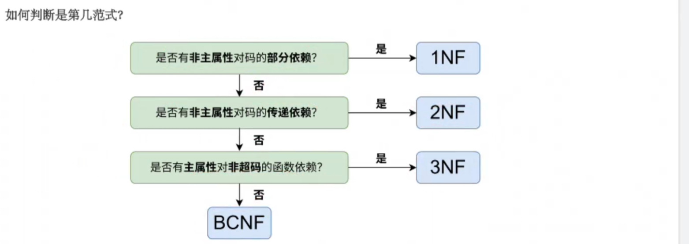
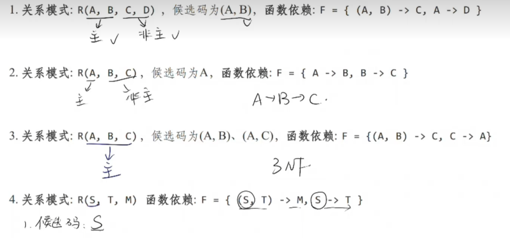

# 第十一周作业 

---

数据库设计理论 

- 依赖
- 完全函数依赖
- 部分函数依赖 
- 范式
    5NF <4NF <BCNF <3NF <2NF <1NF

部分依赖 -> 传递依赖 

非主属性 -> 主属性 

第四范式 (4NF)：消灭“多值依赖”（拒绝两个毫不相干的独立集合硬凑在一张表里）

第五范式 (5NF)：消灭“连接依赖”（也叫完美分解范式 / PJ/NF）

- 判断所有候选码 
- 区分主属性与非主属性 

1. 主属性是A B ， D由A部分依赖 1NF
2. 主属性 A 存在 C 由A 传递依赖 2NF
3. 主属性 ABC C不属于超码 只有 AB AC ABC是超码 3NF

## 概念简答

> 数据依赖对关系模式有什么影响?

在一个关系模式中存在某些数据依赖 导致更新异常 具体为以下四种

- 插入异常
- 删除异常
- 数据冗余
- 修改复杂 

> 下面的结论哪些是正确的，哪些是错误的?对于错误的结论给出一个反例进行说明。
>
> (1)任何一个二目关系都属于3NF.
>
> (2)任何一个二目关系都属于BCNF.
>
> (3)任何一个二目关系都属于4NF.

二目关系一共只有两个属性，根本无法形成那些破坏高级范式的“复杂依赖关系” 因此 3NF BCNF 4NF完全满足

> 指出下列关系模式是第⼏范式?并说明理由。
> (1)R(X,Y,Z)，F={XY→Z}
> (2)R(X,Y,Z)，F={Y→Z, XZ→Y}
> (3)R(X,Y,Z)，F={Y→Z, Y→ZX, X→YZ}
> (4)R(X,Y,Z)，F={X→Y, X→Z}
> (5)R(W,X,Y,Z)，F={X→Z, WX→Y}

1. 主属性 X Y 不存在部分依赖 不存在传递依赖 主属性不存在对于超码的依赖
2. 候选码为 XY XZ 主属性为 XYZ  而主属性是 Z  依赖于 Y 而Y不是超码 因此是 BCNF

3. 候选码为 X, Y 主属性是 XY 非主属性Z对于 X Y没有部分依赖 并且 Y -> X X -> Y 均成立 也不会影响2NF的传递依赖 XY都不由Z依赖 不影响3NF 为BCNF
4. 候选码是X 主属性也是X  不存在非主属性对于码的部分依赖 也不存在传递依赖 也不存在主属性对于非超码的 函数依赖 是BCNF
5. 候选码 X W  非主属性 Y Z 存在Z对X的部分依赖 1NF

## 综合分析

> 设有⼀关系 R(S#,C#,G,TN,D)，其属性的含义为: S#—学号，C#—课程，G—成绩，
> TN—任课教师，D—教师所在的系
>
> 这些数据有以下语义:
> 学号和课程号分别与其代表的学生和课程⼀⼀对应;⼀个学⽣所修的每门课程都有⼀个成
> 绩;每门课程只有⼀位任课教师，但每位教师可以有多门课程;教师中没有重名，每个教师
> 只属于⼀个系
> (1)试根据上述语义确定函数的依赖集
> (2)关系 R 为第⼏范式?并举例说明在进⾏增、删操作时的异常现象。
> (3)试把 R 分解成 3NF 模式集，并说明理由

> (S#,C#) -> G
>
> C# -> TN
>
> TN -> D

 $F = \{ (S\#, C\#) \rightarrow G, \quad C\# \rightarrow TN, \quad TN \rightarrow D \}$

候选键 S# C# 也是主属性 非主属性是D TN 

D只对C# 部分依赖 是1NF 

- **插入异常：** 新建一个系 D 与老师TN 但是没有S# 和 C# 无法插入新老师和系
- **删除异常：** 假设选修某个C#的学生全部退课 那么有关TN ~ D的关系都失去了

---

拆分 $SC(S\#, C\#, G)$  $CTD(C\#, TN, D)$

 但是此时存在传递依赖 再

**$CT(C\#, TN)$**  **$TD(TN, D)$**  即可

> 设由关系模式R<U,F>,其中:
> U={A,B,C,D,E}, F={A→D,E→D,D→B,BC→D,DC →A}
> (1)求出R的所有的候选键。
> (2)判断ρ={AB,AE,CE,BCD,AC}是否为无损连接分解

候选键 E C 存在 A -> D  D -> A  主属性 CE 

---

| **子模式** | **A**     | **B**     | **C**     | **D**     | **E**     |
| ---------- | --------- | --------- | --------- | --------- | --------- |
| $R_1(AB)$  | **$a_1$** | **$a_2$** | $b_{13}$  | $b_{14}$  | $b_{15}$  |
| $R_2(AE)$  | **$a_1$** | $b_{22}$  | $b_{23}$  | $b_{24}$  | **$a_5$** |
| $R_3(CE)$  | $b_{31}$  | $b_{32}$  | **$a_3$** | $b_{34}$  | **$a_5$** |
| $R_4(BCD)$ | $b_{41}$  | **$a_2$** | **$a_3$** | **$a_4$** | $b_{45}$  |
| $R_5(AC)$  | **$a_1$** | $b_{52}$  | **$a_3$** | $b_{54}$  | $b_{55}$  |

- **运用 $A \rightarrow D$**（A相同的，D也必须相同）：

$R_1, R_2, R_5$ 的 $A$ 都是 $a_1$。将它们的 $D$ 统一修改为 $b_{14}$。

- **运用 $E \rightarrow D$**（E相同的，D也必须相同）：

$R_2, R_3$ 的 $E$ 都是 $a_5$。此时 $R_2$ 的 $D$ 是 $b_{14}$，所以把 $R_3$ 的 $D$ 也改为 $b_{14}$。

- **运用 $D \rightarrow B$**（D相同的，B也必须相同）：

此时 $R_1, R_2, R_3, R_5$ 的 $D$ 全都是 $b_{14}$。因为 $R_1$ 的 $B$ 列是正确符号 **$a_2$**，所以把这四行的 $B$ **全部改成 $a_2$**。

- **运用 $BC \rightarrow D$**（B和C相同的，D也必须相同）：

$R_3, R_4, R_5$ 的 $B$ 都是 $a_2$，$C$ 都是 $a_3$。它们的 $D$ 列分别是 $b_{14}, a_4, b_{14}$。遇到正确符号 $a_4$ 优先，因此**把整张表里的所有 $b_{14}$ 全面升级为 $a_4$**。

- **运用 $DC \rightarrow A$**（D和C相同的，A也必须相同）：

经过上一轮，$R_3, R_4, R_5$ 的 $D$ 是 $a_4$，$C$ 是 $a_3$。看这三行的 $A$ 列，发现 $R_5$ 是正确符号 **$a_1$**。于是将 $R_3$ 和 $R_4$ 的 $A$ 列也改为 **$a_1$**。

| **子模式**    | **A**     | **B**     | **C**     | **D**     | **E**     |
| ------------- | --------- | --------- | --------- | --------- | --------- |
| $R_1(AB)$     | $a_1$     | $a_2$     | $b_{13}$  | $a_4$     | $b_{15}$  |
| $R_2(AE)$     | $a_1$     | $a_2$     | $b_{23}$  | $a_4$     | $a_5$     |
| **$R_3(CE)$** | **$a_1$** | **$a_2$** | **$a_3$** | **$a_4$** | **$a_5$** |
| $R_4(BCD)$    | $a_1$     | $a_2$     | $a_3$     | $a_4$     | $b_{45}$  |
| $R_5(AC)$     | $a_1$     | $a_2$     | $a_3$     | $a_4$     | $b_{55}$  |

CE列存在全正确的情况 为无损连接分解
