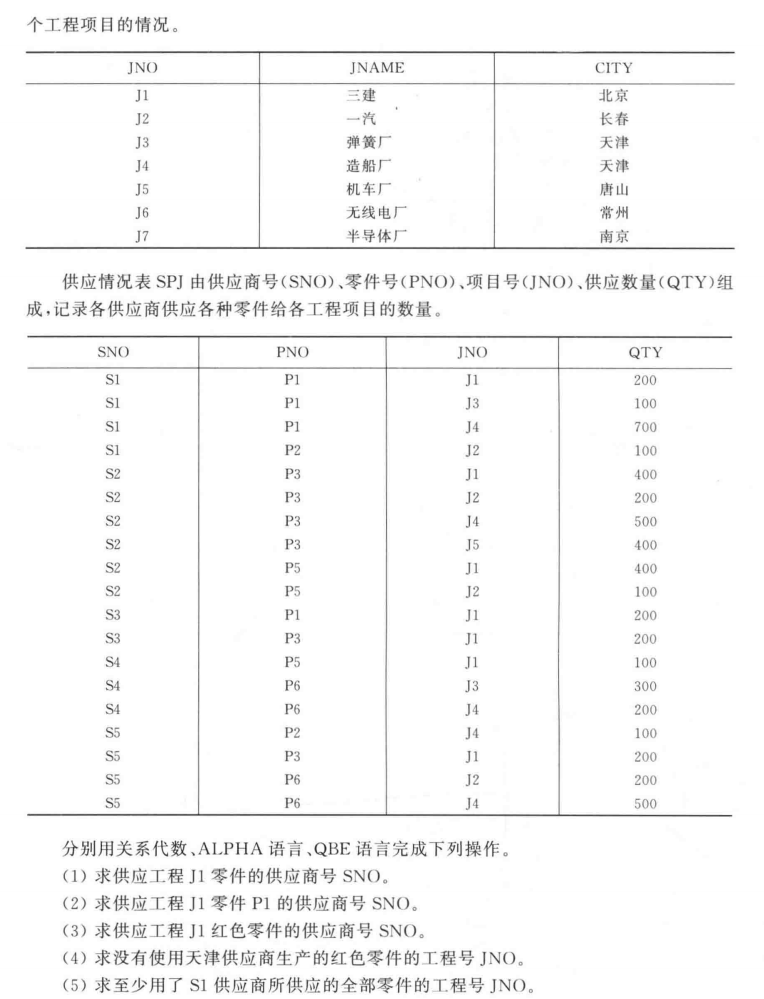

# Unit4作业

本周内容主要为SQL语句相关概念基础 题量不大

## 1

> SQL有哪些特点?

高度非过程化语言

一体化 包括DQL DDL DML DCL为一体

面向集合进行操作

两种使用方式 统一一种语法结构

简洁易学


## 2




> 设有四个关系模式:
>
> S(SNO, SNAME, CITY);
>
> P(PNO, PNAME, COLOR, WEIGHT);
>
> J(JNO, JNAME, CITY);
>
> SPJ(SNO, PNO, JNO, QTY);
>
> 其中，
>
> 供应商表S有供应商号(SNO)、供应商姓名(SNAME)、供应商所在城市(CITY)组成，记录各个供应商的情况;
>
> 零件表P由零件号(PNO)、零件名称(PNAME)、零件颜色(COLOR)、零件重量(WEIGHT)组成，记录各种零件的情况;
>
> 工程项目表J由项目号(JNO)、项目名(JNAME)、项目所在城市(CITY)组成，记录各个工程项目的情况;
>
> 供应情况表SPJ由供应商号(SNO)、零件号(PNO)、项目号(JNO)、供应数量(QTY)组成，记录各供应商供应各种零件给各工程项目的数量。
>
> (这四张表的实例见教材P63-64页)。
>
> 请用SQL建立这四个表，
>
> S(SNO, SNAME, CITY);
>
> P(PNO, PNAME, COLOR, WEIGHT);
>
> J(JNO, JNAME, CITY);
>
> SPJ(SNO, PNO, JNO, QTY)

用SQL建表 按照逻辑关系 SPJ表中 SNO PNO JNO 都需要写REFERENCE 参考上面三个表的外键

```SQL
CREATE TABLE S
(
	SNO VARCHAR(4) CHECK (SNO LIKE 'S___') NOT NULL,
    SNAME VARCHAR(8) NOT NULL,
    CITY VARCHAR(8) NOT NULL
);

CREATE TABLE P
(
	PNO VARCHAR(4) CHECK (PNO LIKE 'P___') NOT NULL,
    PNAME VARCHAR(8) NOT NULL,
    COLOR VARCHAR(8) NOT NULL,
    WEIGHT INTEGER NOT NULL
);

CREATE TABLE J
(
	JNO VARCHAR(4) CHECK (JNO LIKE 'J___') NOT NULL,
    JNAME VARCHAR(8) NOT NULL,
    CITY VARCHAR(8) NOT NULL
);

CREATE TABLE SPJ
(
	FOREIGN KEY SNO REFERENCES S,
    FOREIGN KEY PNO REFERENCES P,
    FOREIGN KEY JNO REFERENCES J,
    QTY INTERGER NOT NULL
);

```

## 3

> 请用SQL完成下列操作:  
> 1)求供应过程J1零件的供应商号SNO。  
> 2)求供应过程J1零件P1的供应商号SNO。  
> 3)求供应过程J1红色零件的供应商号SNO。  
> 4)查找重量超过20的红色零件的零件编号和名称。  
> 5)查找项目所在城市未知的的项目信息。  
> 6)查找供应商姓名的第二个字为“泰”的供应商信息。  
> 7)统计各城市的供应商人数。  
> 8)查找红色零件的零件编号、名称及重量。  
> 9)查找红色零件的零件名称及同名称零件的最大重量。  
> 10)统计各零件名称的平均重量，只查找红色且最大重量不超过30的零件名称。并请按照平均重量降序排列

1)求供应过程J1零件的供应商号SNO

JNO SNO 找SPJ表 

```SQL
SELECT SNO FROM SPJ WHERE JNO = 'J1';
```

2)求供应过程J1零件P1的供应商号SNO

JNO PNO SPJ表

```SQL
SELECT SNO FROM SPJ WHERE JNO = 'J1' AND PNO = 'P1';
```

3)求供应过程J1红色零件的供应商号SNO

JNO COLOR 找SNO 

考虑思路为 JNO & COLOR -> PNO ; 走SPJ表 -> SNO

```SQL
SELECT SPJ.SNO FROM SPJ, P WHERE SPJ.JNO = 'J1' AND P.COLOR = 'RED' AND SPJ.PNO = P.PNO;;
```

4)查找重量超过20的红色零件的零件编号和名称

查PNO PNAME 由WEIGHT信息 查P表 

```SQL
SELECT PNO,PNMAE FROM P WHERE WEIGHT > 20;
```

5)查找项目所在城市未知的的项目信息

看不懂 J1~J7不都写了CITY吗 那不就是没有所在城市未知的项目吗...

6)查找供应商姓名的第二个字为“泰”的供应商信息

查S表的SNO CITY, 从SNAME 要求第二个字符为"泰"

```SQL
SELECT SNO,CITY FROM S WHERE SNAME LIKE "_泰%";
```

7)统计各城市的供应商人数

从S表 要对CITY去重 并且COUNT SNAME的信息 最后用Group by CITY分组

```SQL
SELECT CITY, COUNT(SNO) AS SupplierCount FROM S GROUP BY CITY; 
```

8)查找红色零件的零件编号、名称及重量

查P表 COLOR -> PNO ; WEIGHT ; PNAME

```SQL
SELECT PNO, WEIGHT, PNAME FROM P WHERE COLOR = 'RED'
```

9)查找红色零件的零件名称及同名称零件的最大重量

对P表 由COLOR 要查NAME 对于WEIGHT排序 要按照同名来放 那么GROUP BY PNAME即可 

```SQL
SELECT PNAME MAX(WEIGHT) AS MaxWeight FROM P WHERE COLOR = 'RED' GROUP BY PNAME;
```

10)统计各零件名称的平均重量，只查找红色且最大重量不超过30的零件名称。并请按照平均重量降序排列

P 首先需要算AVG(WEIGHT) 用PNAME GROUP BY 再根据COLOR WEIGHT 来找 PNAME 并且ORDER BY

```SQL
SELECT PNAME AVG(WEIGHT) AS AvgWeight 
FROM P 
WHERE COLOR = 'RED'
GROUP BY PNAME
HAVING MAX(WEIGHT) <= 30 
ORDER BY (AvgWeight) DESC;
```

