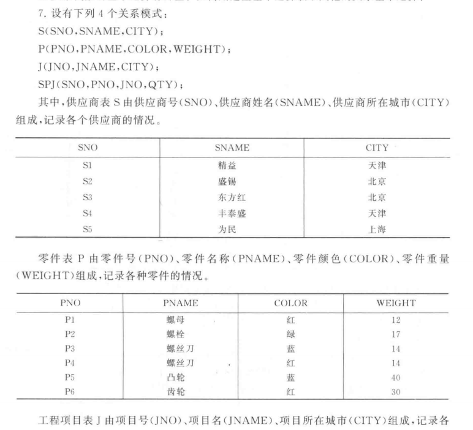

# 第五周

>
> 设有四个关系模式:
>
> S(SNO, SNAME, CITY);
>
> P(PNO, PNAME, COLOR, WEIGHT);
>
> J(JNO, JNAME, CITY);
>
> SPJ(SNO, PNO, JNO, QTY);
>
> 其中，
>
> 供应商表S有供应商号(SNO)、供应商姓名(SNAME)、供应商所在城市(CITY)组成，记录各个供应商的情况;
>
> 零件表P由零件号(PNO)、零件名称(PNAME)、零件颜色(COLOR)、零件重量(WEIGHT)组成，记录各种零件的情况;
>
> 工程项目表J由项目号(JNO)、项目名(JNAME)、项目所在城市(CITY)组成，记录各个工程项目的情况;
>
> 供应情况表SPJ由供应商号(SNO)、零件号(PNO)、项目号(JNO)、供应数量(QTY)组成，记录各供应商供应各种零件给各工程项目的数量。
>
> (这四张表的实例见教材P63-64页)
>
> 请用SQL完成下列操作:
>
> 1)求没有使用天津供应商生产的红色零件的工程号JNO。
>
> 2)求至少使用了S1供应商所供应的全部零件的工程号JNO。
>
> 3)查找没有同城供应商的项目信息。
>
> 4)查找工程项目的同城供应商。
>
> 5)查找供应商号、供应商姓名以及供应 的项目总数。
>
> 6)查找供应的项目总数超过3的供应商号、供应商姓名。




> 1)求没有使用天津供应商生产的红色零件的工程号JNO

要查JNO 已知COLOR 走P表 得到PNO的约束 但是还要把供应商约束加上 考虑从S表 由CITY来查SNO

所以思路 先得出 使用了天津供应商生成的红色零件的工程号 再减去

```SQL
JJ = 
SELECT JNO 
FROM SPJ 
WHERE SNO IN (
	SELECT SNO
    FROM S
    WHERE CITY = 'TJ'
) 
AND PNO IN (
	SELECT PNO 
    FROM P
    WHERE COLOR = 'RED'
);

SELECT JNO IN J WHERE JNO NOT IN JJ;
```


> 2)求至少使用了S1供应商所供应的全部零件的工程号JNO

查JNO 但是把SNO和零件号PNO扯上关系 思路为 从SPJ表 取所有SNO为S1的PNO 为P# 然后检索使用PNO大于P#的JNO 

考虑反义

查询一个零件的工程号JNO 使得 **不存在**一个零件 这个零件由S1供应 JNO没用这个零件

```SQL
SELECT JNO FROM SPJ X
WHERE NOT EXISTS (
	SELECT * FROM SPJ Y 
    WHERE Y.SNO = 'S1' # 遍历的对象Y 的供应商是S1
    AND NOT EXISTS (
    	SELECT * FROM SPJ Z
        WHERE Z.JNO = X.JNO AND Z.PNO = Y.PNO
    )
)
```

第一层 遍历的对象是 SPJ中的元素X 我们希望对于所有满足供应商SNO是S1的Y 不存在一个零件 Z 满足Z和X是一个工程号（一个工程） 但是 Z和Y是同一个零件


> 3)查找没有同城供应商的项目信息

项目与供应商同城 也就是J.CITY == S.CITY 可以给SPJ S J 表查出来 

先看

```SQL
J2 = 
SELECT SPJ.JNO 
FROM SPJ, S, J
WHERE SPJ.SNO = S.SNO
AND	  SPJ.JNO = J.JNO
AND   S.CITY  = J.CITY
```

再不去查询

```SQL
SELECT JNO, JNAME, CITY 
FROM J
WHERE JNO NOT IN J2
```


> 4)查找工程项目的同城供应商

查的是S.SNAME 可以先找项目和供应商相同的写法

```SQL
S2 = 
SELECT SPJ.SNO 
FROM SPJ, S, J
WHERE SPJ.SNO = S.SNO
AND	  SPJ.JNO = J.JNO
AND   S.CITY  = J.CITY
```

再正向

```SQL
SELECT SNAME
FROM S
WHERE SNO IN S2
```

> 5)查找供应商号、供应商姓名以及供应 的项目总数

从S表查SNO 然后把SNO对应SPJ的JNO进行计数 用COUNT

```SQL
SELECT S.SNO, S.SNAME COUNT(DISTINCT SPJ.JNO) AS COUNTS 
FROM S, SPJ
WHERE S.SNO = SPJ.SNO
GROUP BY S.SNO, S.SNAME;
```

> 6)查找供应的项目总数超过3的供应商号、供应商姓名

查S的SNO SNAME 要求这里的 COUNT > 3

```sql
SELECT S.SNO, S.SNAME
FROM S, SPJ
WHERE S.SNO = SPJ.SNO             
GROUP BY S.SNO, S.SNAME            
HAVING COUNT(DISTINCT SPJ.JNO) > 3;  
```

