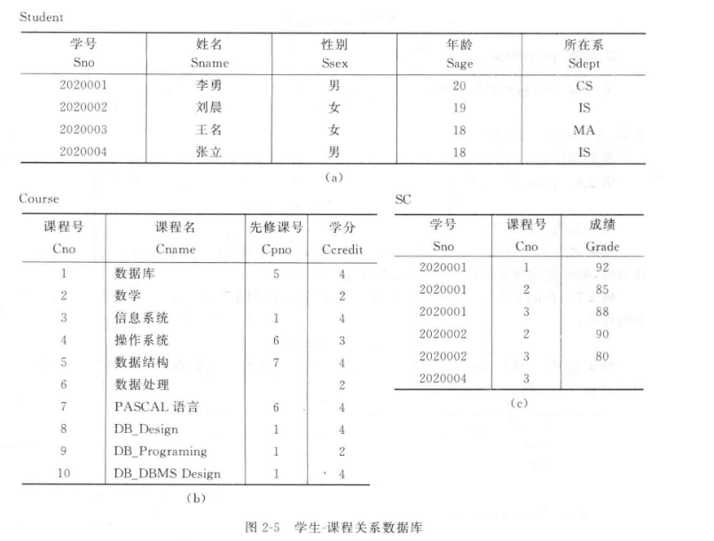

# 第六以及第七周作业

## 第六周

!!! question
	完整性约束条件可分为哪几类?

- 声明性约束 
    - 数值取值要求
    - 域约束 
    - 实体完整性
    - 参照完整性
    - 一般约束
- 过程性约束
    - 触发器 

!!! question
	DBMS的完整性控制机制应具有哪些功能?

- 提供定义完整性约束条件的机制
    通过DDL 规定主键 外键 通过CHECK ASSERTION 定义约束
- 提供完整性检查的方法
    DBMS能够对用户的增 删 改操作进行检测 拦截会破坏一致性的指令
- 进行违约处理
    能对完整性检查的结果做出反应


!!! question
	RDBMS在实现参照完整性时需要考虑哪些方面?

同上者有一定类似

- 提供基础的定义机制
    能够支持定义主键与外键
- 准确监控引发冲突的各种操作
- 提供多样化的违约处理策略
- 支持细粒度的事件绑定


/// details | Q4

设有四个关系模式:

> S(SNO, SNAME, CITY);
>
> P(PNO, PNAME, COLOR, WEIGHT);
>
> J(JNO, JNAME, CITY);
>
> SPJ(SNO, PNO, JNO, QTY);

其中，供应商表S有供应商号(SNO)、供应商姓名(SNAME)、供应商所在城市(CITY)组成，记录各个供应商的情况;

零件表P由零件号(PNO)、零件名称(PNAME)、零件颜色(COLOR)、零件重量(WEIGHT)组成，记录各种零件的情况;

工程项目表J由项目号(JNO)、项目名(JNAME)、项目所在城市(CITY)组成，记录各个工程项目的情况;

供应情况表SPJ由供应商号(SNO)、零件号(PNO)、项目号(JNO)、供应数量(QTY)组成，记录各供应商供应各种零件给各工程项目的数量。

(这四张表的实例见教材P63-64页)请用SQL完成下列操作:

1)在S表中插入一条供应商信息:(S6，华天，深圳)。

2)把全部红色零件的颜色改为粉红色。

3)将S1供应给J1的零件P1改为由S2供给。

4)删除全部蓝色零件及相应的SPJ记录。


///


> 在S表中插入一条供应商信息:(S6，华天，深圳)

直接进行INSERT吧

```SQL
INSERT INTO S (SNO, SNAME, CITY)
VALUES ('S6', '华天', '深圳');
```


> 把全部红色零件的颜色改为粉红色

考虑UPDATE

```SQL
UPDATE 	P
SET COLOR = 'PINK'
WHERE COLOR = 'RED'
```


> 将S1供应给J1的零件P1改为由S2供给

对象是零件 要改的是供应商号SNO

```SQL
UPDATE SPJ
SET SNO = 'S2'
WHERE SNO = 'S1' AND JNO = 'J1'
```


> 删除全部蓝色零件及相应的SPJ记录。

蓝色要查P表 删SPJ表

```SQL
DELETE 
FROM SPJ
WHERE PNO IN (
	SELECT PNO 
    FROM P 
    WHERE COLOR = 'BLUE'
) 

DELETE
FROM P
WHERE COLOR = 'BULE'
```


/// details | Q5

假设有下面两个关系模式:
职工(职工号，姓名，年龄，职务，工资，部门号)，其中职工号为主码;
部门(部门号，名称，经理名，电话)，其中部门号为主码。
请用SQL定义这两个关系模式，要求在模式中完成以下完整性约束条件的定义。
(1)定义每个模式的主码。
(2)定义参照完整性
(3)定义职工年龄不得超过60岁

///


建表

```SQL
CREATE TABLE 部门 (
    部门号 CHAR(10) PRIMARY KEY,   -- 主码
    名称 VARCHAR(50),
    经理名 VARCHAR(50),
    电话 VARCHAR(20)
);
```

```SQL
CREATE TABLE 职工 (
	职工号 CHAR(10) PRIMARY KEY, -- 主码
    姓名 VARCHAR(50),
    年龄 INT CHECK(年龄 <= 60), -- 年龄约束
    职务 VARCHAR(50),
    工资 DECIMAL(10,2),
    部门号 CHAR(10),
    FOREIGN KEY (部门号) REFERENCES 部门(部门号)  -- 参照完整性
);
```


## 第七周



对学生-课程数据库(具体内容见教材P47的图2-5)，编写存储过程，完成下面功能。
1)统计离散数学的成绩分布情况，即按照各分数段统计人数。
2)统计任意一门课程的平均成绩。
3)将学生选课成绩从百分制改为等级制(即A、B、C、D、E).


> 统计离散数学的成绩分布情况，即按照各分数段统计人数

```SQL
CREATE OR REPLACE PROCEDURE Stat_Discrete_Math_Grades 
AS
	va INT := 0;
	vb INT := 0;
	vc INT := 0;
	vd INT := 0;
	ve INT := 0;
BEGIN
	SELECT
		NVL(SUM(CASE WHEN Grade >= 90 THEN 1 ELSE 0 END), 0),
		NVL(SUM(CASE WHEN Grade >= 80 AND Grade < 90 THEN 1 ELSE 0 END), 0),
		NVL(SUM(CASE WHEN Grade >= 70 AND Grade < 80 THEN 1 ELSE 0 END), 0),
		NVL(SUM(CASE WHEN Grade >= 60 AND Grade < 70 THEN 1 ELSE 0 END), 0),
		NVL(SUM(CASE WHEN Grade < 60 THEN 1 ELSE 0 END), 0),
	INTO va, vb, vc, vd, ve
	FROM SC
	JOIN Course ON SC.Cno = Course.Cno
	WHERE Course.Cname = '离散数学'
	
	DBMS_OUTPUT.PUT_LINE('90-100分 (A): ' || v_a || ' 人');
    DBMS_OUTPUT.PUT_LINE('80-89分 (B): ' || v_b || ' 人');
    DBMS_OUTPUT.PUT_LINE('70-79分 (C): ' || v_c || ' 人');
    DBMS_OUTPUT.PUT_LINE('60-69分 (D): ' || v_d || ' 人');
    DBMS_OUTPUT.PUT_LINE('60分以下 (E): ' || v_e || ' 人');
END;
```


> 统计任意一门课程的平均成绩

```sql
CREATE OR REPLACE PROCEDURE Get_Avg_Grade (
	p_canme IN Course.Cname%TYPE -- 输入参数
)
AS
	v_avg_grade NUMBER(5,2);
BEGIN
	SELECT AVG(Grade) INTO v_avg_grade
	FROM SC
	JOIN Course ON SC.Cno = Course.Cno
	WHERE Course.name = p_cname;
	
	IF v_avg_grade IS NOT NULL THEN
        DBMS_OUTPUT.PUT_LINE('课程 [' || p_cname || '] 的平均成绩为: ' || v_avg_grade);
    ELSE
        DBMS_OUTPUT.PUT_LINE('课程 [' || p_cname || '] 暂无成绩记录。');
    END IF;
    
EXCEPTION
	WHEN NO_DATA_FOUND THEN
        DBMS_OUTPUT.PUT_LINE('错误：数据库中不存在该课程。');
END;
/
```


> 将学生选课成绩从百分制改为等级制

```sql
ALTER TABLE SC ADD Grade_Level CHAR(1);
CREATE OR REPLACE PROCEDURE Convert_Grade_To_Level 
AS
BEGIN
    UPDATE SC
    SET Grade_Level = CASE
        WHEN Grade >= 90 THEN 'A'
        WHEN Grade >= 80 THEN 'B'
        WHEN Grade >= 70 THEN 'C'
        WHEN Grade >= 60 THEN 'D'
        WHEN Grade < 60  THEN 'E'
        ELSE NULL 
    END;
    
    COMMIT; 
    DBMS_OUTPUT.PUT_LINE('Done');
END;
/
```

