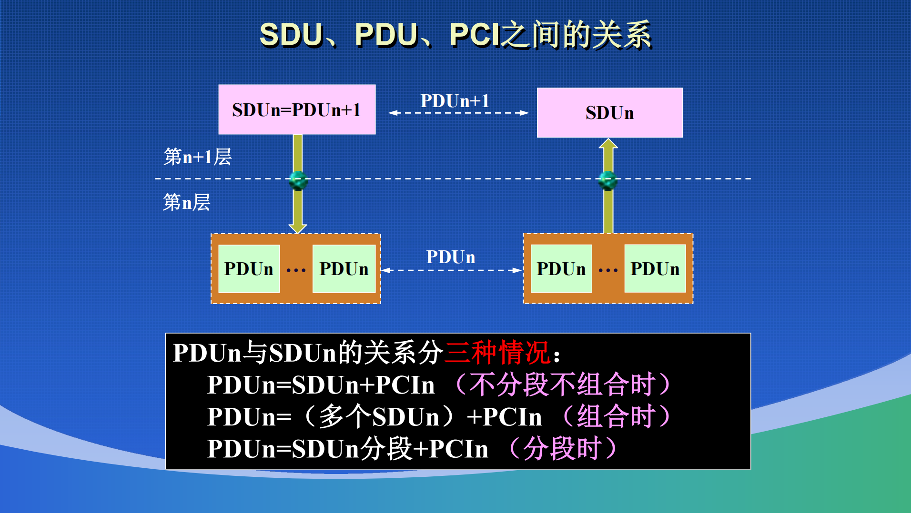

# 基础

## 计算机网络的定义与功能

计算机网络是由具有独立功能的**计算机**、**通信线路**以及实现网络协议的软硬件实体组成的系统

计算机网络的特征是：

- 连通性
- 资源共享

计算机网络按照如下逻辑划分：

- 边缘部分 (Edge)：
    - 即所有的主机 (End System) 组成。面向用户，进行信息处理、数据收发、资源共享，包含 (Clienr/Server) 以及 (Point2Point) 两种通信方式
- 核心部分 (Core):
    - 各类网络，以及对应链接网络的路由器组成，核心为采用存储转发的分组交换技术。

## 计算机网络的技术与分类

- 数据交换技术：
    - 电路交换
        即从端到端的**专用物理交流通路**，独占信道，传输时延小，适合连续大批量数据传输；但信道利用率低，缺乏弹性
    - 分组交换
        - Store and Forward, 存储转发
        - 给长报文划分为一组组数据块 Packet, 在各个路由器之间进行独立转发
        - 高效利用线路，抗毁性强；但会在路由器中产生处理时延和排队时延

- 传输机制与网络
    - 按照传输机制分类
        - Boardcast 广播通信，所有主机端共享信道
        - Point to Point 点对点通信
    - 按照覆盖范围分类
        **广域网（WAN）**、**城域网（MAN）**、**局域网（LAN）**、**个人区域网（PAN）**
    - 拓扑与分层分类
        同一种物理连接在不同网络层级上的理解是不同的，例如，在物理层通过交换机连接的以太网呈**星型拓扑**，但在数据链路层，因交换机进行隔离与转发，逻辑上形成了独立的点对点逻辑信道。

## 计算机网络体系结构与分层

- Why Layering?
    **降低系统复杂度与实现模块化**
    - **独立性与模块化**：每一层只实现相对独立的功能
    - **透明性**：下层通过层间接口向上层提供服务，上层只需使用下层提供的功能，而无需了解下层的具体实现细节（协议对上层透明）
- Protocol
    为进行网络中的数据交换而建立的规则、标准或约定
    - **语法（Syntax）**：定义数据与控制信息的结构或格式（如报头各字段如何排列）
    - **语义（Semantics）**：定义需要发出何种控制信息、完成何种动作以及做出何种响应
    - **同步/时序（Timing）**：定义事件实现顺序的详细说明（如发送方与接收方的时序配合）

- Protocol ~ Server
    - 都作用于任意可以收发信息的两个软硬件进程 (Entity 实体)
    - Protocol 是水平的，是控制两个乃至多个对等实体之间的规则集合
    - Server 是垂直的，是低层实体通过接口向上层实体提供的通信功能
        - 服务，乃至整个计算机网络系统的设计，都是自底向上的，高层不需要知道低层的具体结构，低层只需要向高层提供封装好的服务

- 数据的封装 (Encapsulation)
    - SDU (Server Data Unit) 服务数据单元 	
    - PCI (Protocol Control Imformation) 协议控制信息
    - PDU (Protocol Data Unit) 协议数据单元

PDU 是高层之间传递的分组单元，不难理解

$\text{PDU}_n = \text{SDU}_n + \text{PCI}_n$

- Main Model 
    - ISO / OSI
    - TCP / IP
    - IEEE 802

PPT 上有他们不同的具体封装结构