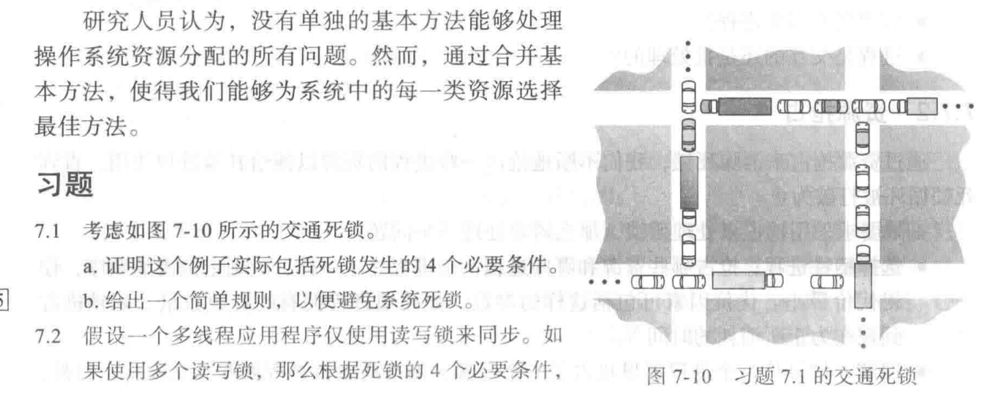
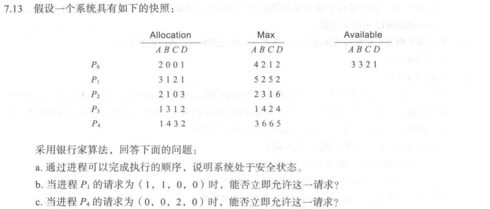

# 死锁

## 概念简析

### 死锁的发生条件

- 资源互斥/不共享
- 占有资源不可剥夺
- 已请求资源保持
- 循环等待

### 对应的处理策略

#### 预防死锁

- 破坏不剥夺
    面对申请及时释放已占有资源
- 破坏资源请求保持
    类似“银行家算法” 一次性申请完全部所需资源

- 破坏循环等待
    有序资源分配 不发生竞态


#### 执行中避免死锁

- 银行家算法


#### 死锁动态检测与解除


## 作业

### 7.1



a.

- 资源互斥/不共享
    车位占据的空间同一时间只能为一辆车所用
- 占有资源不可剥夺
    当某辆车占据了一个空间的时候 其他车无法将其挤走
- 已请求资源保持
    当汽车新到而产生无法通行时 无法简单空出自己的位置
- 循环等待
    每一条队列的车头在等待空间资源前进 但是其本身的等待阻碍了其余队列申请空间资源 产生循环

b. 

采用优先级的方法 以队列的通行方向划分 Up Down Left Right 当存在U/D的车辆时 R/L的车辆需静止 不行驶 可以避免死锁


### 7.7


设进程为 $P_i$ 可知 当某进程申请到2个资源的时候 就一定能在有限时间内释放

最坏情况 每个进程申请占有一个资源 即 $(1,1,1)$ 此时还存在一个空闲资源 可以供给一个进程使用 并且合理释放 所以系统不会死锁

### 7.8


设进程为 $P_i\;\;i=1,2,\cdots,n$ 其需要的资源数用 $s_i$表示 则
$$
s_i<m\\\sum s_i < m+ n
$$
对于第一点 可以防止一个进程占据完 $m$个资源 而且无法执行完的情况

对于第二点 如果出现 $(s_1-1,s_2-1,\cdots,c_n-1)$的情况 此时系统剩余的空闲资源数为
$$
free=m-(\sum s_i - 1\times n) > 0
$$
此时一定会有进程申请到足够的资源完成任务 从而防止死锁


### 7.13



```Bash
     已占据资源   完成所需要   还需要申请
P0    2 0 0 1     4 2 1 2     2 2 1 1
P1    3 1 2 1	  5 2 5 2     2 1 3 1
P2    2 1 0 3     2 3 1 6     0 2 1 3
P3    1 3 1 2     1 4 2 4     0 1 1 2
P4    1 4 3 2     3 6 6 5     2 2 3 3
```

按照 Need矩阵的写法就行

A.

已有 $(3,3,2,1)$ 先完成 $P_0$  

释放已占据资源 得到 $(5,3,2,2)$ 可以完成 $P_3$

释放已占据资源 得到 $(6,6,3,4)$ 可以完成 $P_1$

释放已占据资源 得到 $(9,7,5,5)$ 可以完成$P_2$ 

释放已占据资源 得到 $(11,8,5,8)$ 可以完成$P_4$ 

最终 $(12,12,8,10)$ 序列 
$$
P_0\rightarrow P_3\rightarrow P_1\rightarrow P_2\rightarrow P_4
$$
B. 空闲资源为 $(3,3,2,1)$ 面对 $(1,1,0,0)$ 假设先完成$P_1$ 得到$P_1$释放资源 

此时 $(6,4,4,2)$ 可以完成$P_0$ 

得到 $(8,4,4,3)$ 可以完成后续的 $P_2\;P_3\;P_4$
$$
P_1\rightarrow P_0\rightarrow P_2\rightarrow P_3\rightarrow P_4
$$
C.  空闲 $(3,3,2,1)$ 面对 $(0,0,2,0)$ 假设先完成 $P_4$ 

此时 $(4,7,5,3)$ 显然后续按照 0 1 2 3的顺序可以轻松完成
$$
P_4\rightarrow P_0\rightarrow P_1\rightarrow P_2\rightarrow P_3
$$
