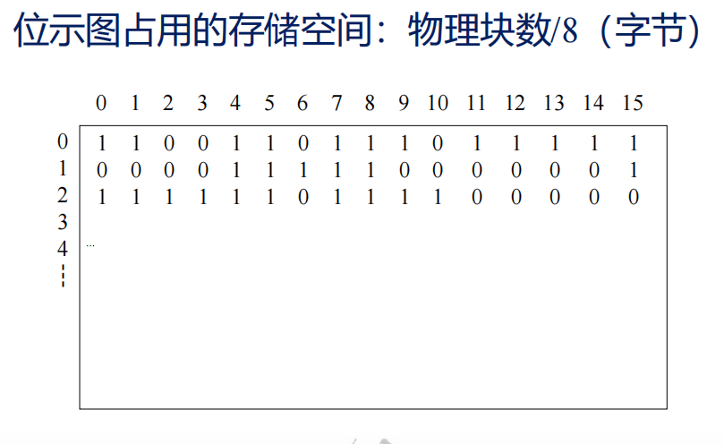
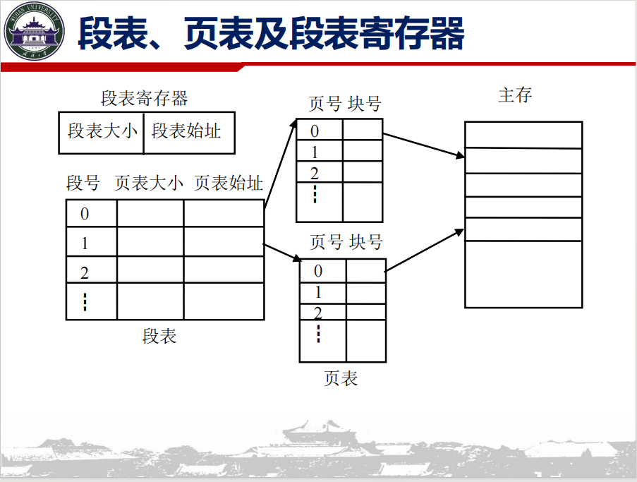
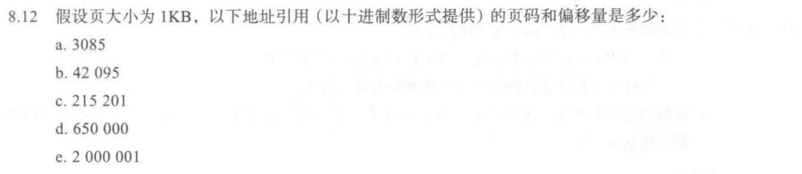
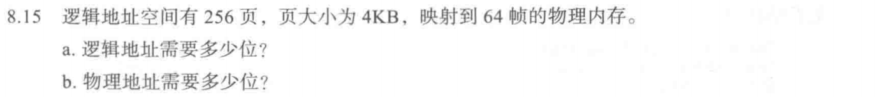
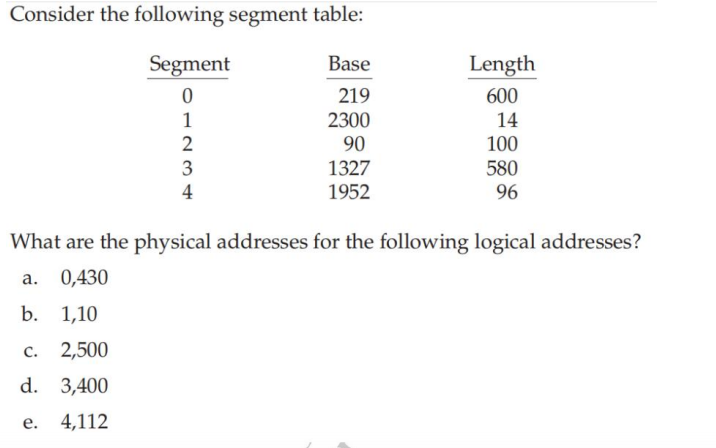

# 存储器管理

## 概念梳理

### 地址

地址分类

- 物理地址
- 基址
- 逻辑地址

地址变换

- 绝对装入
- 静态链接
- 动态重载

### 分区

一块一块的内存地址 存在琐碎的空间碎片 给进程分配内存的时候 还需要关注空间的 Fittness 造就如下分配算法

- 首次适应
    - 循环首次适应
- 最佳适应
- 最坏适应

大多数时间下 无法有效利用完全分区的内存 

#### 动态分区管理与碎片利用

动态拼接各个分区的空余内存 ~ 动态重定位

使用 **伙伴系统** 来帮助 简洁的分配 快速的重新拼接碎片 

### 分配

连续分配

- 单一连续分配
- 分区管理
- 伙伴系统

非连续分配

- 分段
- 分页
- 段页

#### 分页分配

Paging 给内存划分为页框以及不同的页 

逻辑地址可以使用页号+页内偏移来划分 同时注意二进制下的逻辑地址结构该怎么写

#### 分段分配

段存储更加具备逻辑性 譬如 

- **主程序段**（Main）

- **子程序段**（Subroutines）

- **数据段**（Data）

- **堆栈段**（Stack）

地址参照 段号 + 段内地址

与分页不太一样 无法直接按照格式截断 拼接二进制 但是对于不同的进程 如果存在相同的运行段 段内地址的分配是可以复用的

#### 段页分配

先按照程序的逻辑运行段 划分段

再在段内划分一个一个页 保持格式的规整 再在页内进行偏移地址的确定

不同程序之间的相同逻辑段可以复用 而页内的偏移确定又帮助高效简便地计算实际地址

允许段内末尾留白 

#### 位示图

快速得到存在空闲的空间 

#### 页表与快表

计组里应该涉及到过 快表存储在主存外类似Cache 先查TLB 如果miss再去查主存的页表就行

页表本身也存在分类

- 多级页表
- 哈希页表
- 反向页表

| **特性 / 维度**    | **多级页表 (Multi-level)** | **哈希页表 (Hashed)**          | **反向页表 (Inverted)**                |
| ------------------ | -------------------------- | ------------------------------ | -------------------------------------- |
| **表格数量**       | 每个进程独立拥有一套       | 每个进程独立拥有（或全局）     | **整个系统仅此一张**                   |
| **表项对应关系**   | 一项对应一个**虚拟页**     | 一项对应一个**虚拟页**         | 一项对应一个**物理页帧**               |
| **64位系统适用度** | 较差（树太深，访问内存多） | **非常好**（最适合大地址空间） | **极好**（物理内存越大越划算）         |
| **地址翻译速度**   | 取决于树的层数（慢）       | 取决于链表长度（平均快）       | 最慢（需要遍历搜索，必须挂靠哈希加速） |
| **最核心的优势**   | 保持物理块 4KB 的极端规整  | 能够快速处理极大的稀疏地址     | 彻底限制了页表对内存空间的消耗         |

#### 页段

- 确定段号 判断是否段内越界
- 计算页表始址

- 从页表读出物理块，计算物理地址

## 习题

页大小为1024

a.  $3085/1024 = 3$ 偏移为 $3085 \% 1024 = 13 $

b.  $42095/1024 = 41$ 偏移为 $42095 \% 1024 = 111 $

c.  $215201/1024 = 210$ 偏移为 $215201 \% 1024 = 161 $

d.  $650000/1024 = 634$ 偏移为 $650000 \% 1024 = 784 $

e.  $2000001/1024 = 1953$ 偏移为 $3085 \% 1024 = 129 $

逻辑地址可以拆成页号 + 页内偏移 

0~255 共8位 页内偏移 $2^{12}$共12 + 8 = 20位逻辑地址

而实际物理只有64帧 那么只需要6位即可记录完备物理帧 一共需要18位物理地址

a.分页内存需要先查页表 再查内存 一共需要两次访存 共100ns

b.TLB访存有效 只需一次TLB 再访存 如果失效 则TLB + 页表 + 主存
$$
t = \alpha (t+m) + (1-
\alpha)(t+2m)
$$
带入 

$t = 64.5ns$ 

a. 0,430位于段0 实际地址为 219 + 430 = 649 

b. 1,10位于段1 实际地址为 2310

c. 2,500位于段2 偏移大于段长度 发生段错误

d. 3,400位于段3 实际地址为1727

e. 4,112位于段4 发生段错误