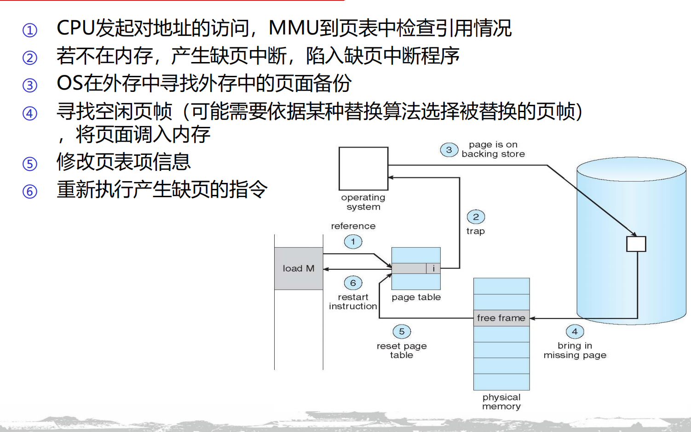
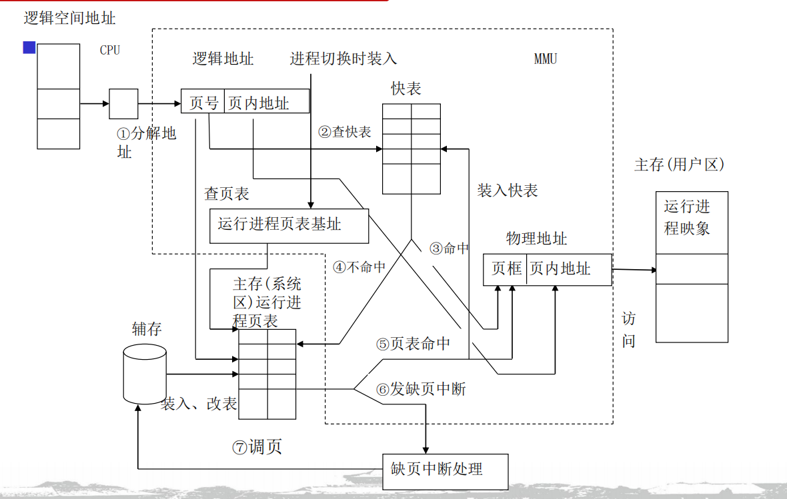
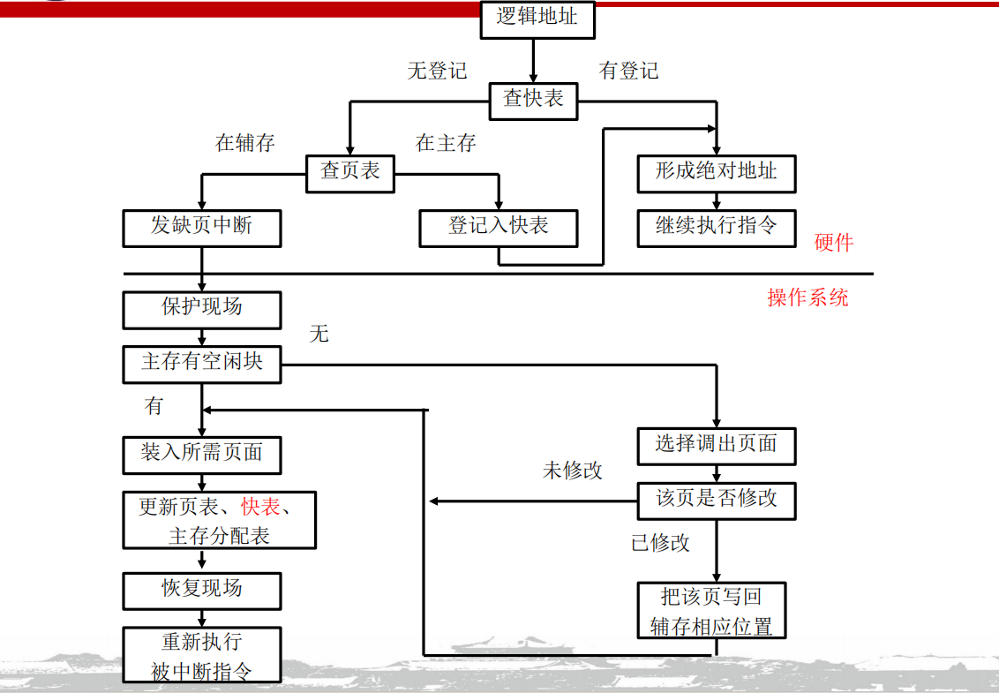
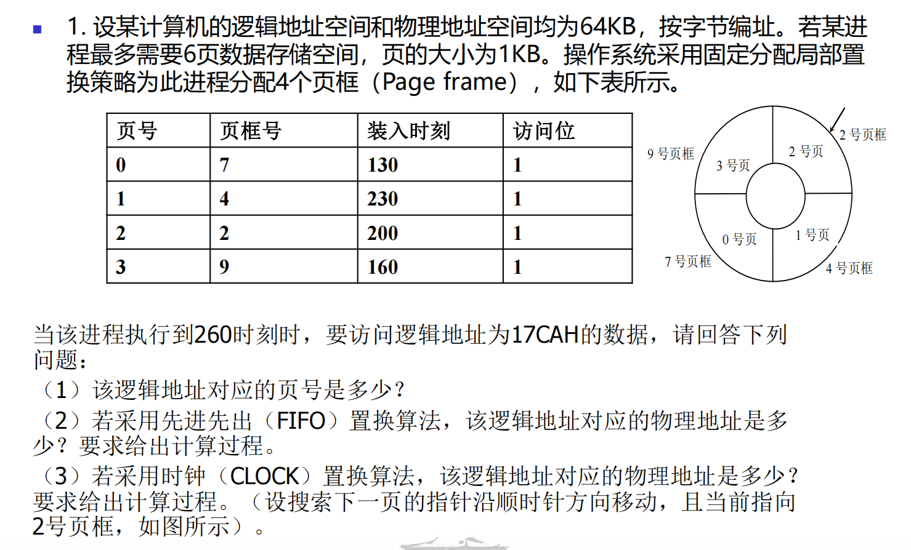
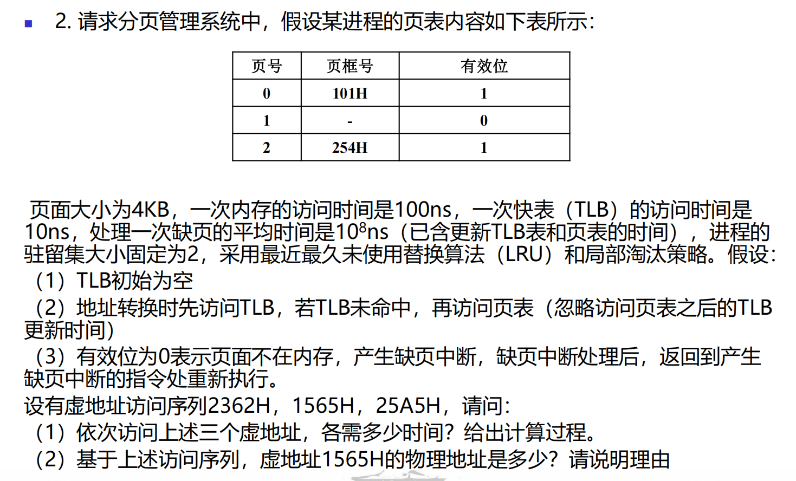
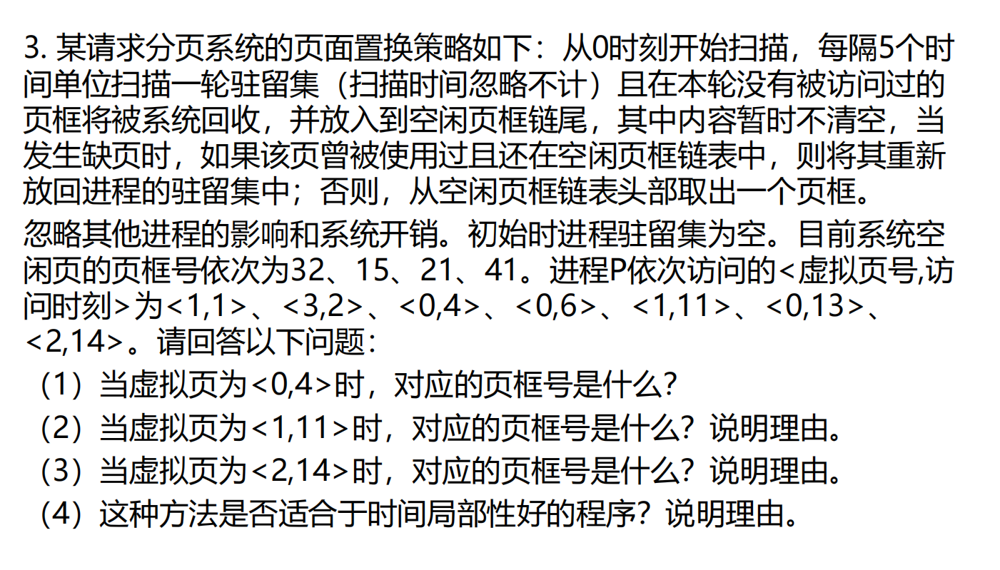

# 虚拟存储

## 概念梳理

### 理论基础

- 程序存在**局部性原理**
    作业在执行中只需存入少部分必要信息到主存中
    - 时间局部性
    - 空间局部性
    - 顺序局部性

### 定义

> 虚拟存储器（也称为虚拟内存）是指具有请求调入和置换功能，能从逻辑上对内存容量加以扩充的一种存储器系统

特性：

- 离散性
- 多次性
- 对换性
- 虚拟性

### 请求分页存储

> 在分页存储管理的基础上增加了请求调页和页面置换功能

结构基础

- MMU
- 页表

---

逻辑地址的定义

- **存在位：** 最重要的一个状态，用来表示该页当前到底是在内存里（1），还是在磁盘上（0）  

- **访问字段：** 记录这个页面最近被访问的频率或时间。这是留给后面的“页面替换算法”做参考用的（比如找出哪个页面最不常使用）

- **修改位：** 记录这个页面调入内存后，有没有被修改过。如果修改过（1），淘汰时必须把新数据写回外存；如果没有修改过（0），直接扔掉就行，不用白费时间写磁盘 

- **外存地址：** 明确指出这个页面在硬盘上的具体物理位置，方便操作系统去捞它

---

执行流程

- 按需装入
    运行作业时只装入部分需要页面
- 缺页中断
    MMU查询到所需页面不在内存中，中断作业，申请OS调页面回来(页面访址)
- 页面置换
    内存已满后，淘汰旧页面填入新页面(页面替换算法)

---

### 按需装入

这里的按需并非某种提前规划，CPU按照PC的变化规律申请地址访问请求，每个请求都会被MMU审计，根据存在位的信息选择正常调页，还是缺页中断。更多的是一种被动化的执行思路流程。

### 缺页中断

- CPU申请访存，MMU得到虚拟地址
- MMU发现VA的的存在位为0，页面不在内存，触发缺页中断
- MMU申请OS介入，去外存寻找备份
- OS再在内存寻找空闲页框，如果不存在，则需要按照替换算法进行更新
- 调入新页面
- 更新对应的页表信息
- 返回中断指令，继续执行

> 如何区分缺页中断和一般中断？

可以从中断的发生时机，一条指令能产生的中断个数/中断频率，中断返回后的执行情况来进行区分。

---

### 地址变换

当CPU发出对于某组VA的访问请求

- Part1 MMU

    - MMU读取VA，将地址拆分为页号(PN)和页内偏移(Offset)

- Part2 TLB

    MMU根据页号(PN)去查TLB

    - TLB Hit
        从TLB中查到物理页框号，和偏移拼接，读到物理地址(PA)
    - TLB Miss
        去访存，查页表

- Part3 PT
    MMU根据页号查页表项
    - 存在位为1，PT Hit
        - MMU取得物理页框号
        - MMU把页表项更新到TLB，如果TLB已满，则按照替换算法更新
        - 拼接页框号与偏移，得到物理地址
    - 存在位为0，PT Miss
        - 缺页中断
            这里不是不知道地址，页表的外存地址都是如实记录的，只是不在当前的主存中，需要去外存提取，类似一种备份
- Part4 OS
    发生缺页中断，OS介入
    - 停止CPU作业，保存寄存器等现场状态
    - 根据页表项的外存地址，去外存读取相关需要的数据
    - 找到需要的页，调回内存，如果内存已满，根据替换算法更新。如果要淘汰的页被修改，则在硬盘中做好对应的备份。
    - 把新页装入物理块，修改页表项，更新TLB
    - 恢复CPU

如图

### 页面替换算法

#### 最佳替换(OPT)

预测未来，挑选出**将来最长时间内不再被访问的页面**予以淘汰。

理论最优解

#### 先进先出(FIFO)

最早进入的页面最先被替换出去。

给定序列的时候，分配的物理框越多，缺页情况反而越严重(**Belady**)。

#### 最久未使用(LRU)

最久没有访问的页进行替换，重点在实现思路。

- **基于计数器：** 为每个页表项配一个时钟计数器，每次访问更新时间，缺页时挑计数值最小的 
- **基于栈：** 维护一个特殊栈，最近访问的页面抽出来压入栈顶，栈底永远是最久未使用的页面

#### 二次机会(SCR)

与FIFO类似，但是提供了一次缓冲的机会

Clock是SCR的实现实例之一

- 为每个页表项增加一个**引用位 (Reference Bit / R 位)** 。页面一被访问，硬件就把 R 位置为 1

- 将所有页面连成一个**循环队列（像时钟表面）**，设一个替换指针

- **缺页挑选过程：** 指针顺时针扫描

    - 如果遇到 R=1，说明最近用过，暂时先不将其替换，将其置为 0，然后指针继续往下找

    - 如果遇到 R=0，说明最近没用过，直接淘汰该页

#### 改进时钟

> Clock 算法只看了“用没用过”，但忽略了一个致命的性能问题——**修改过的页面写回磁盘极其耗时** 。改进型 Clock 把**引用位 (R)** 和**修改位 (M)** 结合起来考虑

按照排除出去的优先级 **从高到低** 为

1. `R=0, M=0`：最近没用过，也没修改过。（最优替罪羊，直接扔掉就行）   
2. `R=0, M=1`：最近没用过，但被修改过。（次优，踢之前得费事写回硬盘）   
3. `R=1, M=0`：最近用过，但没修改过。（还要用，先留着）   
4. `R=1, M=1`：最近用过，且被修改过。（最宝贵，千万别动）

扫描挑选顺序

1. 第一轮找 `R=0, M=0`，不改变 R 位 。  
2. 如果找不到，第二轮找 `R=0, M=1`，同时**把沿途所有页面的 R 位置 0**（给大家降级，表示没扫到） 。  
3. 如果还找不到，就退回到起点，重复第一轮、第二轮，直到找到为止

还有LFU MFU等

### 页面管理策略

#### 页面装入

- 请求式调度
    只在每轮请求访问VA的时候再去查看页面情况，但是无法预防缺页
- 预调式调度
    基于局部性原理，提前分配几组页面到内存，减少缺页情况、但可能存在更多的浪费

#### 页面清除

- 请求式清除
    只清洗被替换算法，例如LRU等选中的页面
- 预清洗
    操作系统会在系统比较空闲的时候，或者在后台，提前成批地把修改过的页面写回磁盘，把它们洗干净（清零修改位） 。等到需要替换时，发现它们已经是干净的了，直接丢弃即可，大大加快了替换速度

#### 页面分配&替换

- 固定分配 + 局部替换
    每个进程分得的页框数不变，发生缺页中断，只能从该进程的页面中选页替换，保证进程的页框总数不变
- 可变分配 + 全局替换
    每个进程分配一定数目页框，OS保留若干空闲页框
    进程发生缺页中断时，从系统空闲页框中选一个给进程，这样产生缺页中断进程的主存空间会逐渐增大，有助于减少系统的缺页中断次数
    系统拥有的空闲页框耗尽时，会从主存中选择一页淘汰，该页可以是主存中任一进程的页面，这样又会使那个进程的页框数减少，缺页中断率上升
- 可变分配 + 局部替换
    新进程装入主存时，根据应用类型、程序要求，分配给一定数目页框
    产生缺页中断时，从该进程驻留集中选一个页面替换
    不时重新评价进程的分配，增加或减少分配给进程的页框以改善系统性能

### 工作集模型

> 一个进程在当前时段正在使用的页框集合 定义为工作集

- 工作集算法

### 抖动

> 由于频繁缺页，导致运行进程的大部分时间都用于页面的换入/换出，而几乎不能完成任何有效的工作，则称此进程处于抖动（Thrashing）状态。抖动又称为颠簸、颤动

#### 产生原由

- 进程分配物理块过少
- 替换算法不当
- 全局替换
- 进程局部性差

#### 抖动的发现与预防

- 全局范围技术
- L = S
- 利用缺页率
- 平均缺页率

## 作业

64KB地址空间，按字节编址即 $64K\rightarrow2^6\times2^{10}=2^{16}$  16位地址空间

页的大小为1KB 那么页内偏移是10位 页框号需要 6位 策略是固定分配局部替换

1. 17CA -> `0001 0111 1100 1010` 页号取高6位 `000101` 为5
2. 固定存在4组页框 我们按照顺序排列 从进入的先到后排序 当前对应的页号应当是 0 3 2 1 在260时刻，访问了页号为5的情况，触发缺页中断，按照FIFO，移除页号0的内容，塞入页号5的内容，对应页框号为7，拼接得到物理地址为 `000111 1111 0010 10`  即1ECAH因为局部替换原则，这里的页框号是不会变化的
3. 按照CLOCK算法，在260时刻，从2号页开始搜，因为0123的访问位都是1，那么置0后一定会回到2号页，对应页框为2 物理地址为 `000010 1111 0010 10` 即 0BCAH

VA为16位，页面大小为4KB 字节编址下，页内偏移为12为，故而页号占4位 0~15

2362H = `0010 0011 0110 0010` 页号为2  先看TLB，TLB为空，看PT，PT命中，访存一次TLB，PT和主存两次访存，成功命中，用时210ns

1565H  = `0001 0101 0110 0101` 页号为1 看TLB，TLB为空，再看PT，PT缺失，触发缺页中断，由LRU算法，页号2刚刚访问过，故而更新页号为0处的信息，更新页号1到页框101H，用时一次TLB访问，2次访问内存，一次缺页中断，缺页中断后重新访问TLB,总用时 1e8 + 220ns 最终物理地址为 `0001 0000 0001 0101 0110 0101` 101565H

25A5H = `0010 0101 1010 0101` 页号为2 看TLB，存在页框号，TLB命中用时一次TLB和一次访存，110ns

首先 驻留集是不固定的，但是每5个Tick就会进行一次动态的Flush

起初，驻留集为空，页框链为32->15->21->41

从0开始扫描，那么更新时刻是5 10 15 ...

- 访问<1,1> 页号1不在驻留集，分配一个32页框到页表，得到 1<->32 页框链 15->21->41
- 访问<3,2> 页号3不在驻留集，分配15 。 3<->15 页框链 21->41
- 访问<0,4> 页号0不在驻留集，分配21。0<->21 页框链41
- tick = 5 驻留集没有要Flush的
- 访问<0,6> 页号0在驻留集，重新访问页框21
- tick = 10 驻留集中页号1 3都没访问，Flush页框链尾 41->32->15
- 访问<1,11> 页号1不在驻留集，但在页框链，得到41->15 ; 1<->32
- 访问<2,14>页号2不在驻留集，不在页框链，得到15；2<->41
- 最终 在Tick14 驻留集情况 1<->32 2<->41 0<->21 页框链 15
- 使用时间局部性好的，有页框链，能及时缓冲最近访问的页