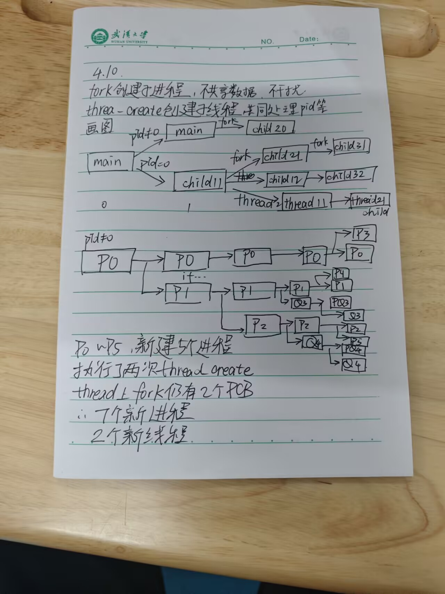
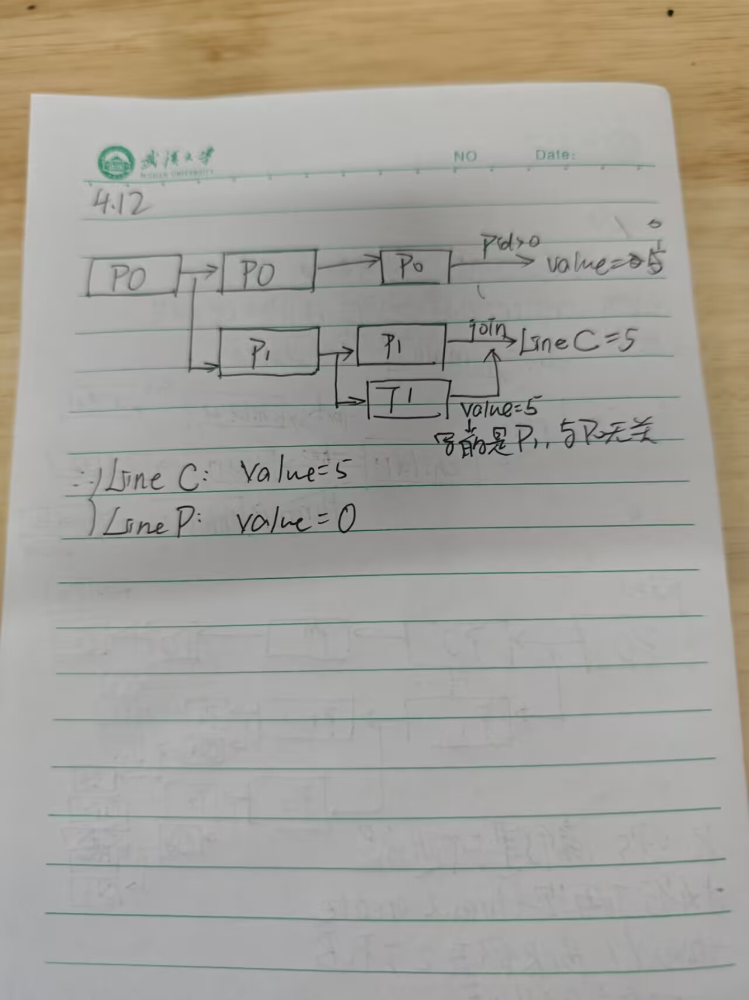

# 1&2






# 3

## 题目描述

1. 设某个多线程的程序代码如下所示。其中，`pthread_create` 函数创建一个独立线程，参数包括线程标识符、函数名称和函数的参数；父线程通过调用 `pthread_join` 函数以等待子进程的结束；线程通过调用 `pthread_exit` 函数结束。具体的函数说明如下表所示。

### 函数说明表

| **类别**     | **内容**                                                     |
| ------------ | ------------------------------------------------------------ |
| **函数定义** | `int pthread_create(pthread_t *tidp, const pthread_attr_t *attr, void* (*start_rtn)(void*), void *arg);` |
| **参数说明** | `tidp`: 指向线程标识符的指针 `attr`: 设置线程属性 `start_rtn`: 线程运行函数的指针 `arg`: 运行函数的参数 |
| **返回值**   | 若线程创建成功，则返回 0。若线程创建失败，则返回出错编号。   |
| **函数定义** | `int pthread_join(pthread_t thread, void **retval);`         |
| **描述**     | `pthread_join()` 函数以阻塞的方式等待 `thread` 指定的线程结束。当函数返回时，被等待线程的资源被收回。如果线程已经结束，那么该函数会立即返回。并且 `thread` 指定的线程必须是 joinable 的。 |
| **参数**     | `thread`: 线程标识符，即线程 ID，标识唯一线程 `retval`: 用户定义的指针，用来存储被等待线程的返回值。 |
| **返回值**   | 0 代表成功。失败，返回的则是错误编号。                       |

------

### 程序代码

C

```C
1  int i = 100;
2  char *buf;
3  
4  void *tfun(void *noarg) {
5      int j = 0;
6      printf("T Child: i=%d, j=%d\n", i, j);
7      printf("T Child: i=%d, j=%d\n", i, j);
8      j = 3;
9      strcpy(buf, "cool");
10     pthread_exit(NULL);
11 }
12 
13 void thread() {
14     pthread_t tid;
15     int j = 1;
16     buf = strcpy(malloc(100), "boring");
17     pthread_create(&tid, NULL, tfun, NULL);
18     printf("T Parent: j=%d\n", j);
19     i = 162;
20     j = 2;
21     printf("T Parent: j=%d\n", j);
22     printf("T Parent: %s\n", buf);
23     j = 4;
24     pthread_join(tid, NULL);
25 }
```

------

### 问题分析

执行上述程序的输出结果中是否会包含以下三组序列，给出分析说明。

| **(1)**                                         | **(2)**                                         | **(3)**        |
| ----------------------------------------------- | ----------------------------------------------- | -------------- |
| T Parent: j=1 ; T Child: i=100, j=1 ; T Parent: j=2 | T Parent: j=1 ; T Parent: j=2 ; T Child: i=100, j=1 | T Parent: cool |

------

## 分析

与fork申请PCB构建进程不同 thread的create是接近并发工作的 相关执行情况需要看内核的调度

关键在于函数 `pthread_create(&tid, NULL, tfun, NULL);` tid是分配给thread的id标识 tfun是线程执行的函数 同主线程一并执行

此时创建了tfun和thread两个线程 同步执行

分析一下 tfun会写的数据为

- j赋值为0
- 打印T child ~ i j的相关信息
- j赋值为3
- 写buf为 `cool`

在此之后 thread函数的行为

- 打印T Parent ~ j
- 写i 为 162
- 写j 为 2
- 打印T Parent ~ j
- 打印缓冲区

这里的`pthread_join(tid, NULL)` 表示thread线程必须等子线程完成之后再结束 当然对于输出没有影响

然后开始梳理

### Case1

`T Parent: j=1`是可能的 在tfun给j写为0之前thread给j为1print出来

但是`T Child: i=100, j=1`是不可能的 如果执行到tfun的`printf("T Child: i=%d, j=%d\n", i, j);` 就必定给j写为0了


### Case2

`T Parent: j=1`可能 同上

`T Parent: j=2`也可能 如果内核给thread更多的资源分配 就可以在tfun给j写为0前执行完thread的j写为2 并且print出来

`T Child: i=100, j=1`但这个就是不可能的了 j被写为其他值后就没法重新赋值为1


### Case3

`T Parent: cool`可能 只需要子线程tfun在 printf buf前执行完即可


所以说只有`T Parent: cool`可能出现

