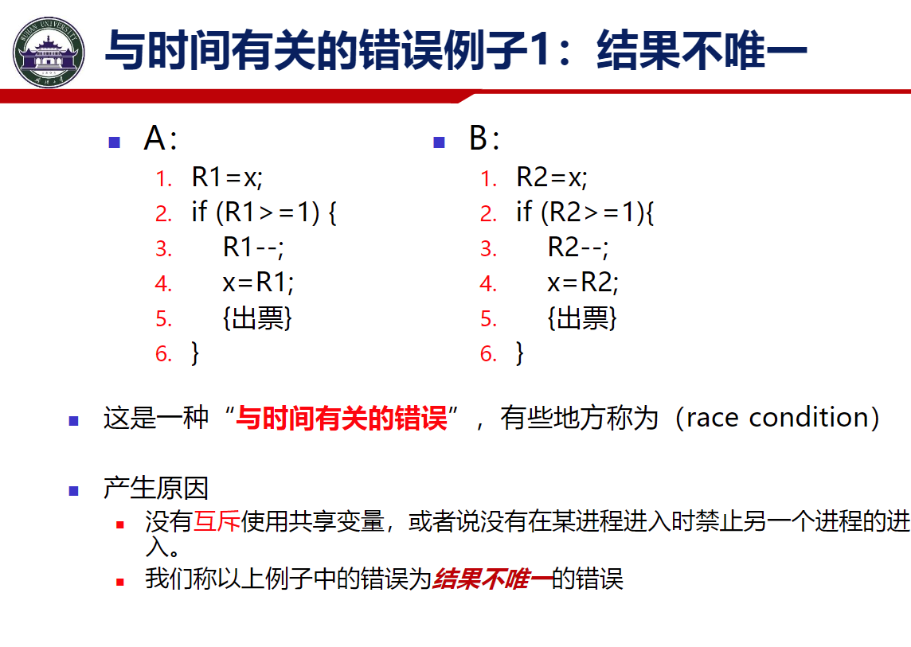
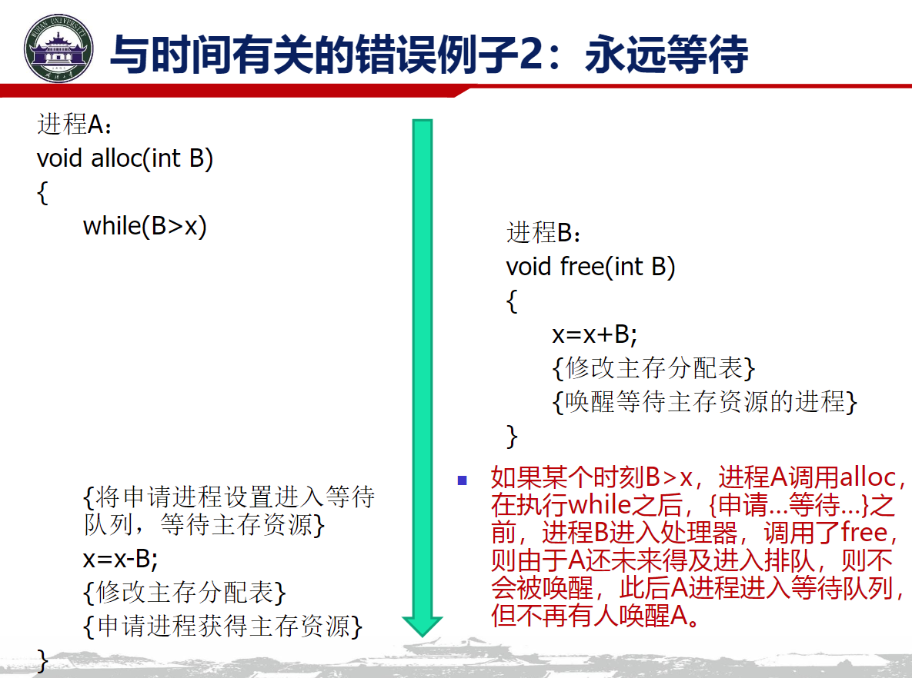
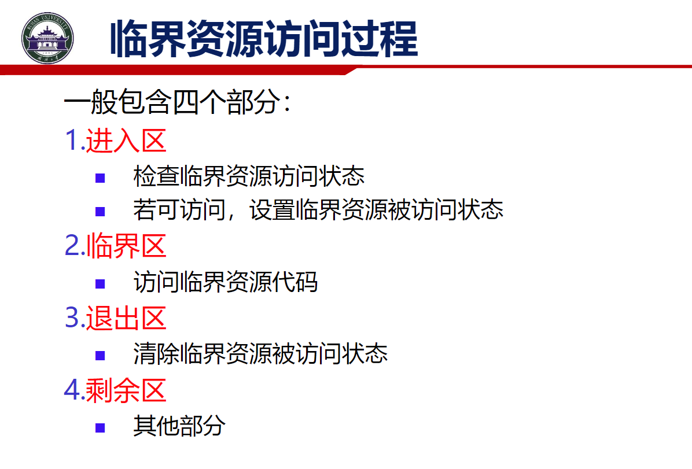
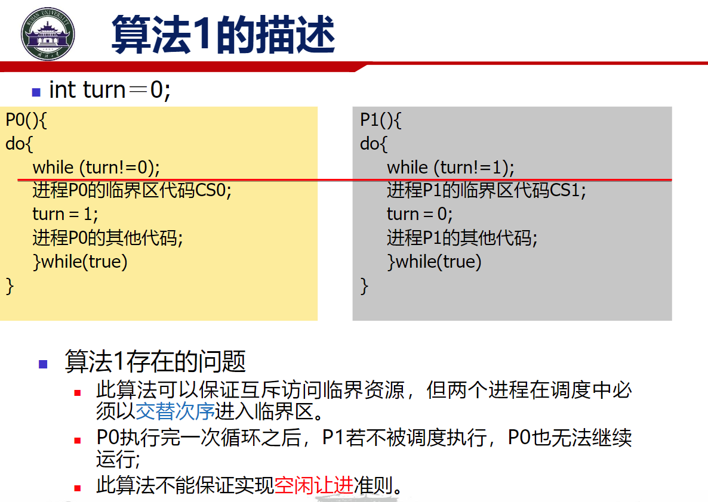
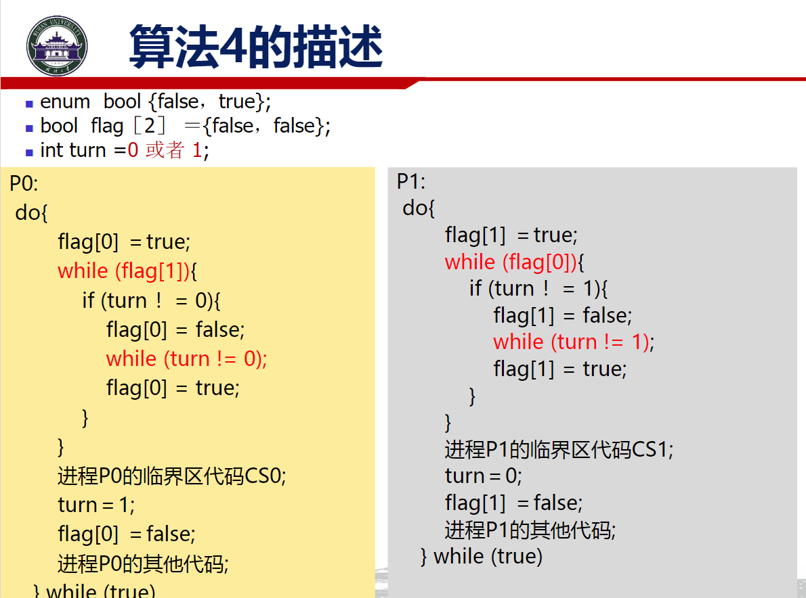
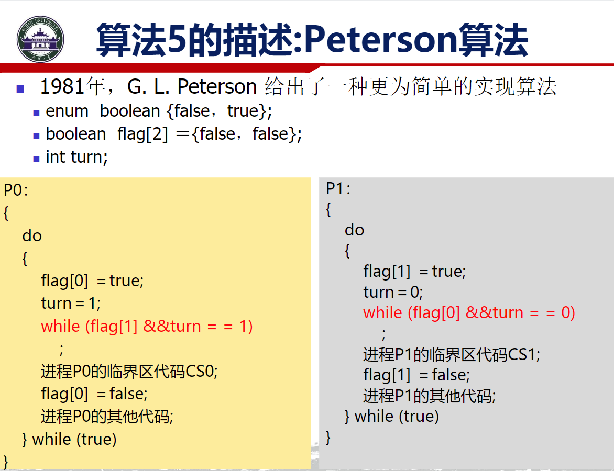
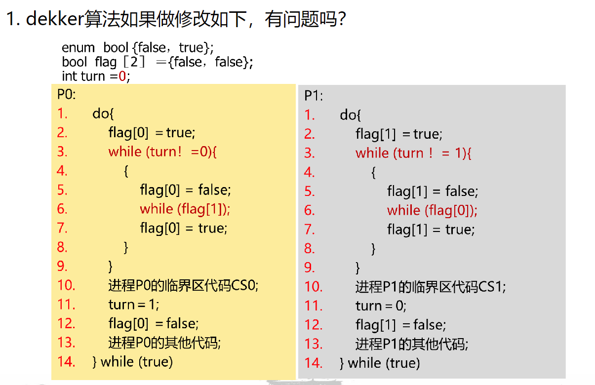
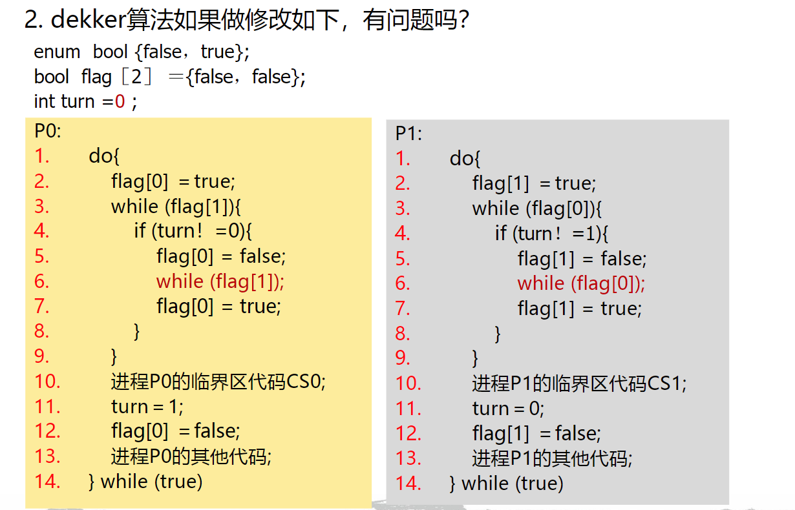
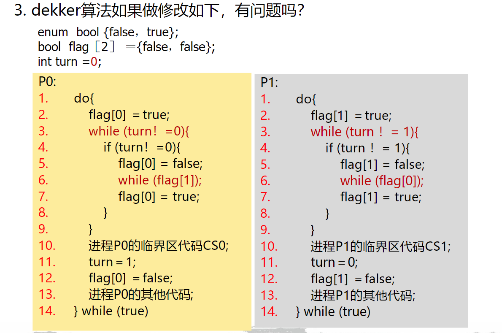

## 进程同步

### 概念

同步与互斥可以从 资源冲突和时序冲突来理解

这里 关于变量x AB进程都有读写改变 则关于x产生了资源冲突 可以发现 只用满足 A B 不同时写x即可 这既是关于资源的**互斥**

这里 free需要唤醒处于等待状态的进程 但是free的调用在设置等待进程前 由此 free永远无法等到处于等待的进程 也即是 永远等待 时序发生错乱

这里明确的 必须先alloc设置一个等待进程 再调用free 唤醒等待进程 即 关于时序问题 需要存在一个时序的同步

---

上述被共同使用的资源被称为临界资源 对应代码称为临界代码 

几个基本原则

### 实现

实现互斥的算法

#### 软件方法

> Dekker Algorithm

> Peterson Algorithm

用flag变量代表临界态进入意愿 turn表示当前优先级 Dekker算法和Peterson算法都是优先谦让的思路 

#### 硬件方法

把锁/解锁设置为硬件态的原子行为 

从自旋锁 -> 互斥锁解决了忙等的问题

---

### 作业

#### 1

P1的循环中 只给flag写了值 没有写turn 所以P1永远处于while循环 P0永远等待while循环

#### 2.

P0 P1同时进入循环 但由于turn为0 flag[1]先被写为false 从而P0先退出while循环 然后由于flag[0]为true flag[1]被写为true 此时P0运行临界代码 再给turn写为1 此时flag[0]写为flase P1退出循环 随后trun写为0 flag[1]写为false 重置状态

**但是如果P0在P1执行临界前 写了flag[0]=true 覆盖原本的flag[0]=false就会让P1卡死在循环当中**

#### 3.

turn初始写为0 那么优先进行P1中的循环 此时flag[1]写为false 再写回true 死循环了？